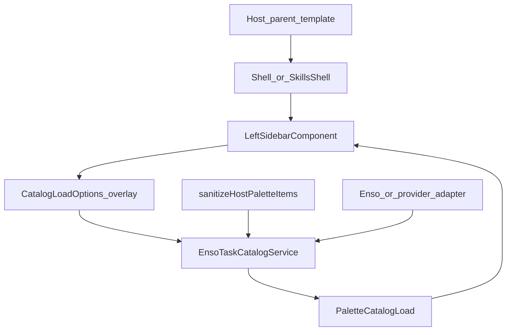

# Domain Entities — U-HPI-01 Host palette inputs

Reuse `PaletteItem`, `DefaultAgentCard`, `PaletteCatalogLoad`, U-PAL-01 helpers. No workflow document schema change.

---

## CatalogLoadOptions (extend)

| Field | Type | Notes |
|---|---|---|
| existing | `mode`, `userCategories`, `includeAgentId`, `itemNodeType` | Unchanged |
| `hostPalettes?` | `PaletteItem[]` | Key present ⇒ overlay; `[]` = empty-remote |
| `hostDefaultAgents?` | `DefaultAgentCard[]` | Key present ⇒ wins over JSON; ignored on EMPTY palettes |

## PaletteCatalogLoad.source (extend)

`'enso' | 'adapter' | 'static' | 'empty' | 'host'`

`host` is used whenever `hostPalettes` is present (EMPTY or OK).

## sanitizeHostPaletteItems

| Input | Output |
|---|---|
| `unknown[]` (or `PaletteItem[]`) | `PaletteItem[]` |

Pure. Drops unknown types and invalid shapes (BR-HPI-07). PBT target (Q9=A).

## Overlay presence

| Angular input | Options key | Meaning |
|---|---|---|
| `undefined` | omitted | U-PAL-02 |
| `[]` | present `[]` | EMPTY |
| items | present items | OK compose after sanitize |

## Relationships

Text alternative: Parent binds inputs on the shell. The sidebar forwards overlay keys on `loadCatalog`. If palettes is present, sanitize runs and Enso/adapter are skipped. The catalog emits `PaletteCatalogLoad` (`source: 'host'` when overlay palettes are present).
