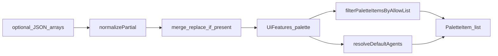

# Domain Entities — U-PAL-01 Palette config core

**Shape**: Q1=B — resolved allow-lists are always-present discriminated unions. JSON/provider still use optional arrays.

---

## AllowListState

```text
AllowListState
  = { mode: 'all' }
  | { mode: 'only', types: NodeType[] }
```

`types` contains only known `NodeType` values (duplicates may be collapsed in normalize). Empty `types` is valid (`only` + none).

## DefaultAgentCard (normalized)

| Field | Type | Notes |
|---|---|---|
| `key` | `string` | Non-empty; unique after last-wins |
| `label` | `string` | Non-empty |
| `description` | `string` | Default `''` |

## DefaultAgentsState

```text
DefaultAgentsState
  = { mode: 'omitted' }
  | { mode: 'present', cards: DefaultAgentCard[] }
```

## PaletteFeatures (resolved, complete)

```text
UiFeatures.palette
├── solution
│   ├── types: AllowListState
│   └── defaultAgents: DefaultAgentsState
└── agent
    └── types: AllowListState
```

No optional groups on the **resolved** object. Skills have no `defaultAgents`.

## PaletteFeaturesPartial (JSON / provider)

```text
palette?: {
  solution?: {
    types?: unknown        // array of strings when valid
    defaultAgents?: unknown
  }
  agent?: {
    types?: unknown
  }
}
```

Presence of `types` / `defaultAgents` is significant. Do not encode `mode` in JSON.

## PaletteItem (existing)

Unchanged. Default-agent rows use `type: 'AIAgent'`, `categoryId: 'logic'`, `key` from the card (not necessarily `'AIAgent'`).

## Known NodeType keys (allow-list)

`Trigger` | `Action` | `Condition` | `Delay` | `End` | `Decision` | `Repeater` | `Notification` | `AIAgent`

Not a key: `Router` (label of `Decision`).

## UiFeaturePath

**Unchanged**. Palette arrays are **not** boolean `is()` paths. Consumers read `features().palette`.

## Relationships

```text
JSON/provider optional arrays
    → normalize (drop unknown types; skip bad cards)
    → merge replace-if-present
    → UiFeatures.palette (AllowListState + DefaultAgentsState)
    → filterPaletteItemsByAllowList / resolveDefaultAgents / applySolutionDefaultAgents
    → PaletteItem[]   (consumed in U-PAL-02)
```



Text alternative: Optional JSON arrays normalize into palette state, merge by whole-key replace, then pure helpers produce `PaletteItem` lists for the catalog unit.

No relationship to `WorkflowDocument` schema.
