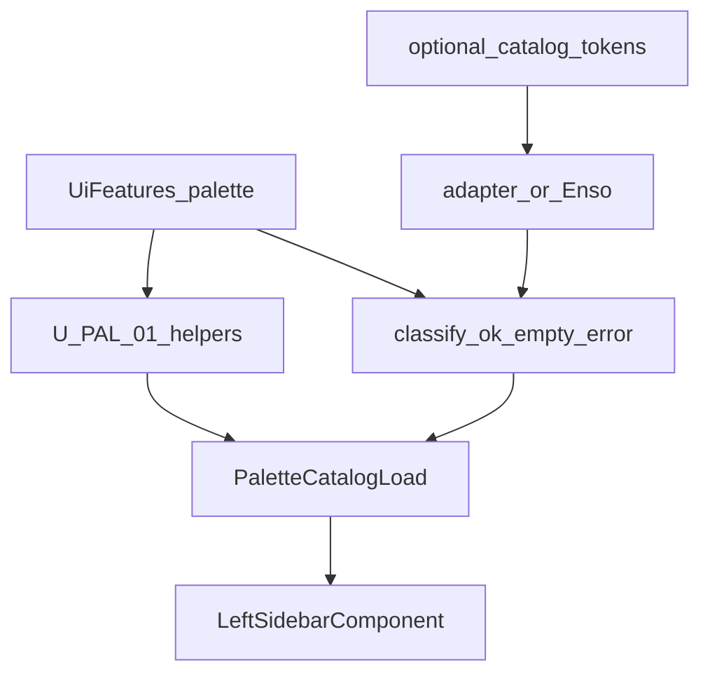

# Domain Entities — U-PAL-02 Catalog wiring + docs

---

## WorkflowBuilderCatalogAdapter

| Field | Type | Notes |
|---|---|---|
| `load(options)` | `Observable<CatalogAdapterResult>` or `Promise<CatalogAdapterResult>` | Remote rows only |

## CatalogAdapterResult

| Field | Type | Notes |
|---|---|---|
| `items` | `PaletteItem[]` | Required |
| `categories` | `PaletteCategory[]` optional | Merged with static categories on OK path |

## Injection tokens

| Token | Canvas |
|---|---|
| `WORKFLOW_BUILDER_CATALOG_SOLUTION` | Agents Library (`solution-agents`) |
| `WORKFLOW_BUILDER_CATALOG_AGENT` | Skills Library (`agent-skills`) |

## PaletteItem (extend)

| Field | Type | Notes |
|---|---|---|
| existing | `key`, `type`, `label`, `description`, `categoryId`, `taskId?`, `taskMeta?` | Unchanged |
| `origin?` | `'default-agent'` | Set only on `resolveDefaultAgents` rows |

## PaletteCatalogLoad (extend)

| Field | Type | Notes |
|---|---|---|
| `categories` | `PaletteCategory[]` | Empty on EMPTY path |
| `items` | `PaletteItem[]` | Empty on EMPTY path |
| `source` | `'enso' \| 'adapter' \| 'static' \| 'empty'` | |
| `error` | `string \| null` | Set on ERROR path only |
| `emptyRemote` | `boolean` | `true` on Q3b=C success-empty |

## ProvideWorkflowBuilderUiOptions (extend)

```text
{
  features?: UiFeaturesPartial
  catalog?: {
    solution?: WorkflowBuilderCatalogAdapter
    agent?: WorkflowBuilderCatalogAdapter
  }
}
```

## Relationships



Text alternative: Palette config and optional adapter tokens feed catalog load. Outcomes classify as ok, empty-remote, or error. U-PAL-01 helpers run on ok/error compose. The sidebar renders `PaletteCatalogLoad`.

No workflow document schema change.
