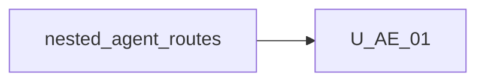

# Unit of Work Dependency — Enter agent without tab bar

**Sequencing**: Single unit (plan Q1=A, Q2=A)

---

## Dependency matrix

| Unit | Depends on | Dependency type | Notes |
|---|---|---|---|
| U-AE-01 | Nested agent route `/agent/:id` | Soft / reuse | `selectAgentTab` + `enterAgentCanvas` already navigate |
| U-AE-01 | `openAgentTab` / `agent-tabs` domain | Soft / change | Skip chip add when `agentTabs.enabled` is false |
| U-AE-01 | Effective UI `agentTabs.enabled` | Soft / reuse | Chrome flag; must not gate routing |
| U-AE-01 | Nested shells (`shell-layout`, `agent-skills-shell`) | Soft / change | Back/Solution when strip not mounted |
| U-AE-01 | Canvas dblclick | Soft / reuse | Already calls `selectAgentTab`; nested already no-ops |
| U-AE-01 | `navigateBackToSolution` | Soft / reuse | Existing exit path; control must not require chips |
| U-AE-01 | View-mode guards | Soft / reuse | Nested edits stay blocked |

No second unit in this increment.

---

## Sequence

```text
Nested agent routes + tab chrome COMPLETE --> U-AE-01 (CG -> Build/Test)
```

Text alternative: One construction unit after shipped nested-agent navigation. Code Generation, then Build and Test. Functional Design skipped.



Text alternative: U-AE-01 depends on shipped nested agent routes and tab chrome. No reverse edge.

---

## Shared resources

| Resource | Owner | U-AE-01 use |
|---|---|---|
| `WorkflowFacade.selectAgentTab` | existing | Keep navigate; do not require chips |
| `WorkflowFacade.openAgentTab` | existing | Skip when bar off |
| `agentTabs.enabled` | UI chrome | Hide strip only |
| `wb-agent-tabs` | existing | Unchanged when bar on |
| Canvas dblclick | existing | Keep enter on solution; no re-enter nested |
| Embed guide | prior increments | Clarify chrome vs routing |

---

## Non-dependencies

- No new microservice or deployable
- No new `core/agent-nav/` module (plan Q3=A)
- No change to `agentTabs.enabled` meaning as a strip flag
- No Properties schema, palettes, or logic-node changes
- No circular import between facade and shells (shells call facade methods)
