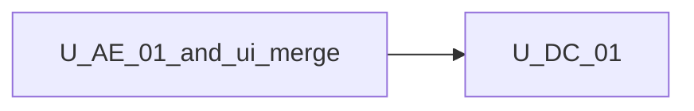

# Unit of Work Dependency — Agent tabs doubleClick config

**Sequencing**: Single unit (plan Q1=A, Q2=A)

---

## Dependency matrix

| Unit | Depends on | Dependency type | Notes |
|---|---|---|---|
| U-DC-01 | UI feature merge (`createDefaultUiFeatures` / `pickBooleanLeaves`) | Soft / change | Add `doubleClick` leaf; default true |
| U-DC-01 | `injectEffectiveUi` on canvas | Soft / reuse | `onNodeDblClick` reads `agentTabs.doubleClick` |
| U-DC-01 | U-AE-01 enter without tabs | Soft / reuse | Nested no-re-enter; strip vs routing already split |
| U-DC-01 | `selectAgentTab` | Soft / reuse | Call only when dblclick flag is true |
| U-DC-01 | Chip `focusAgentTabChrome` | Soft / reuse | Unchanged when strip on |
| U-DC-01 | Instance `[ui]` sticky overlay | Soft / reuse | Nested shell omit `[ui]` keeps host overlay |
| U-DC-01 | Embed docs + example JSON | Soft / change | Document the new leaf |

No second unit in this increment.

---

## Sequence

```text
U-AE-01 + UI chrome merge COMPLETE --> U-DC-01 (CG -> Build/Test)
```

Text alternative: One construction unit after shipped tab-strip chrome and nested enter. Code Generation, then Build and Test. Functional Design skipped.



Text alternative: U-DC-01 depends on shipped U-AE-01 and UI config merge. No reverse edge.

---

## Shared resources

| Resource | Owner | U-DC-01 use |
|---|---|---|
| `AgentTabsFeatures` | UI config | Add `doubleClick` |
| `mergeUiFeatures` | UI config | Default true; explicit false wins |
| `canvas-viewport.onNodeDblClick` | canvas | Gate navigate |
| `WorkflowFacade.selectAgentTab` | existing | Unchanged API; called only if flag true |
| `agentTabs.enabled` | UI chrome | Independent; hide strip only |
| Embed guide | prior increments | Add `agentTabs.doubleClick` |

---

## Non-dependencies

- No new microservice or deployable
- No new helper module (plan Q3=A)
- No change to nested Back / Solution (U-AE-01)
- No Properties schema, palettes, or logic-node changes
- No circular import between facade and canvas (canvas already injects effective UI)
