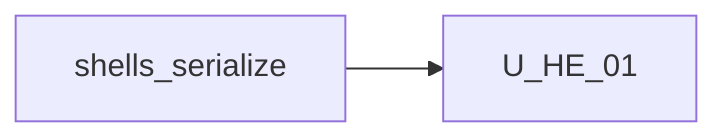

# Unit of Work Dependency — Host embed contract

**Sequencing**: Single unit (plan Q1=A, Q2=A)

---

## Dependency matrix

| Unit | Depends on | Dependency type | Notes |
|---|---|---|---|
| U-HE-01 | `WorkflowDocument` + serialize/parse | Soft / reuse | Invalid parse must not wipe canvas |
| U-HE-01 | `WorkflowFacade` graph/history | Soft / change | load/get/dirty; flush nested before get |
| U-HE-01 | `provideWorkflowBuilderUi` | Soft / change | Add `persist.save` / `persist.run` |
| U-HE-01 | `wb-shell-layout` | Soft / change | `[document]`, outputs, height 100% |
| U-HE-01 | Save/Run chrome (zoom bar, shortcuts) | Soft / change | Dispatch via facade |
| U-HE-01 | Nested agent canvas | Soft / reuse | Flush on getDocument |
| U-HE-01 | View-mode Save disable | Soft / reuse | Unchanged |

No second unit in this increment.

---

## Sequence

```text
Shells + serialize + Save/Run chrome COMPLETE --> U-HE-01 (CG -> Build/Test)
```

Text alternative: One construction unit after shipped shells and serialize. Code Generation, then Build and Test. Functional Design skipped.



Text alternative: U-HE-01 depends on shipped shells and serialize. No reverse edge.

---

## Shared resources

| Resource | Owner | U-HE-01 use |
|---|---|---|
| `serializeWorkflow` / `parseWorkflowJson` | existing | Load fail-safe; getDocument clone |
| Autosave dirty | existing | Expose as host dirty (or alias) |
| Save button / ⌘S | existing | Call persist.save or `saveDownload` |
| Run button | existing | Call persist.run or simulated Run |
| Embed guide | prior increments | Add document + persist + height |

---

## Non-dependencies

- No new microservice or deployable
- No new `core/embed-contract/` folder (plan Q3=A)
- No ng-packagr
- No Properties schema, palettes, or agent-tab routing changes
- Nested shell does not own solution `[document]`
