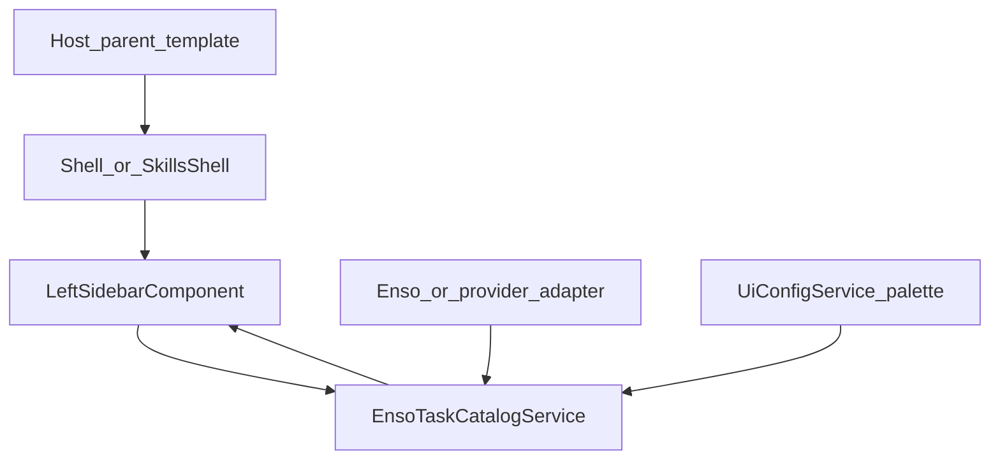

# Component Dependency — Host palette inputs (Syncfusion-style)

---

## Dependency matrix

| Consumer | Depends on | Relationship |
|---|---|---|
| Host parent template | `wb-shell-layout` / `wb-agent-skills-shell` | Binds `[palettes]` / `[defaultAgents]` |
| ShellLayout | LeftSidebar | Passes overlay inputs |
| AgentSkillsShell | LeftSidebar | Passes `[palettes]` |
| LeftSidebar | EnsoTaskCatalogService | `loadCatalog` with overlay options |
| EnsoTaskCatalogService | UiConfigService, optional catalog tokens, U-PAL-01 helpers | Overlay short-circuits adapter/Enso when palettes present |
| Docs | Shell public inputs | Embed example |

**Non-dependency**: Shells do **not** provide catalog tokens. Sidebar does **not** drop unknown types.

---

## Communication patterns

- **Input binding** (Syncfusion-like): parent → shell → sidebar.
- **Pull on load**: sidebar → catalog `loadCatalog`.
- **No event bus**. Catalog remains a root singleton.

---

## Data flow

Text alternative: The host parent binds inputs on the shell. The shell passes them to the left sidebar, which calls the catalog service. If palettes is omitted, the catalog uses Enso or the provider adapter and UiConfig palette. If palettes is present, that list is the remote source.

---

## Unit mapping

| Unit | Owns |
|---|---|
| **U-HPI-01** | Shell/skills inputs, sidebar overlay, catalog overlay + unknown-type drop, embed docs (US-HPI-01..06) |

**Sequence**: Single unit.

---

## Coupling notes

- Detect **presence** with `input() === undefined`, not empty-array default.
- Reload catalog when overlay inputs change.
- Keep U-PAL-02 empty-remote UI for `[]`.
