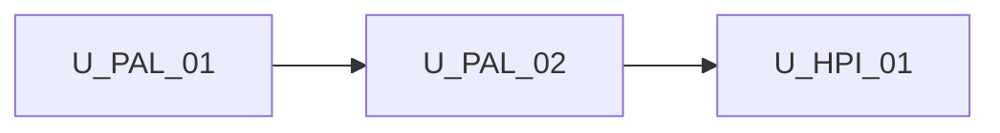

# Unit of Work Dependency — Host palette inputs (Syncfusion-style)

**Sequencing**: Single unit (plan Q2=A)

---

## Dependency matrix

| Unit | Depends on | Dependency type | Notes |
|---|---|---|---|
| U-HPI-01 | **U-PAL-02** | Soft / reuse (already shipped) | Empty-remote, featured strip, adapter vs Enso |
| U-HPI-01 | **U-PAL-01** | Soft / reuse | Allow-list filter; `resolveDefaultAgents` |
| U-HPI-01 | `ShellLayoutComponent`, `AgentSkillsShellComponent`, `LeftSidebarComponent` | Soft / extend | Overlay inputs |
| U-HPI-01 | `EnsoTaskCatalogService` | Soft / extend | Present overlay short-circuits adapter/Enso |

No second unit in this increment. No hard wait on a U-PAL-02 re-test gate (Q2=A).

---

## Sequence

```text
U-PAL-01 COMPLETE --> U-PAL-02 COMPLETE --> U-HPI-01 (FD -> CG -> Build/Test)
```

Text alternative: Host palette inputs is one construction unit after Increment B. Functional Design, Code Generation, then Build and Test.



Text alternative: U-HPI-01 depends on completed U-PAL-02. No reverse edge.

---

## Shared resources

| Resource | Owner | U-HPI-01 use |
|---|---|---|
| `filterPaletteItemsByAllowList` | U-PAL-01 | Still filters parent items |
| `resolveDefaultAgents` | U-PAL-01 | Host list when `[defaultAgents]` present |
| Catalog tokens / Enso | U-PAL-02 | Used only when `[palettes]` omitted |
| Empty-remote empty-state | U-PAL-02 | `[palettes]="[]"` |
| Featured strip | U-PAL-02 | Shown when palettes items present |

---

## Non-dependencies

- No new microservice or deployable
- Catalog remains `providedIn: 'root'` (App Design Q1=A)
- Shells do not provide catalog tokens
- Sidebar does not drop unknown types (catalog does)
- No circular import: domain helpers must not import shells
