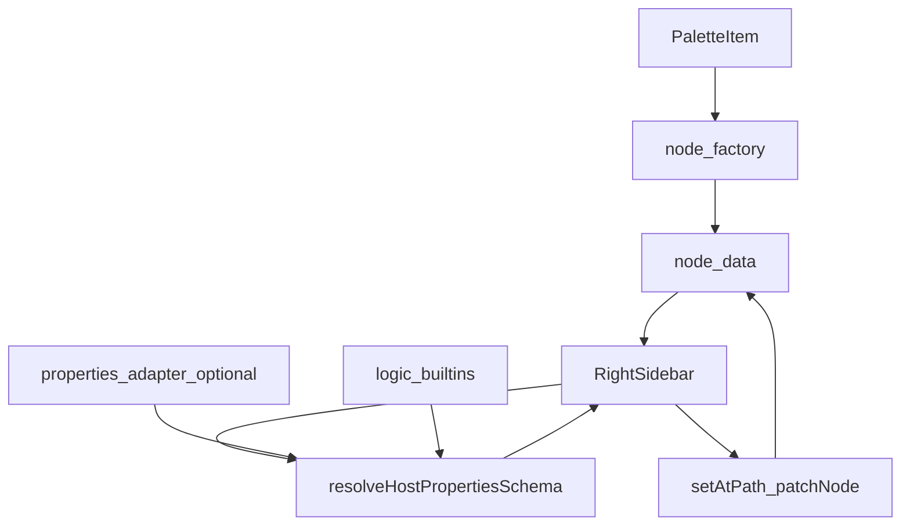

# Component Dependency — Generic host-driven Properties

---

## Dependency matrix

| Consumer | Depends on | Relationship |
|---|---|---|
| `resolveHostPropertiesSchema` | sanitize + logic built-ins + optional adapter | Pure |
| `RightSidebarComponent` | resolver, `getAtPath` / `setAtPath`, facade draft/save | UI |
| `provideWorkflowBuilderUi` | properties token | Optional DI |
| `createWorkflowNodeFromPaletteItem` | `PaletteItem` | Copy only |
| Embed docs | public types + provider options | Examples without Enso names |

**Non-dependency**: Sidebar does not import `collectEnsoTaskFields`. Factory does not write `ensoTask`. Resolver does not call HTTP. No instance `[properties]` input.

---

## Communication patterns

- **Drop copy**: palette item → `node.data` (schema + opaque `taskMeta`).
- **Optional DI**: host `schemaFor` when node has no schema.
- **Existing**: chrome `[ui]`, `[palettes]`, catalog adapters unchanged.
- **No event bus**.

---

## Data flow

Text alternative: Palette drop copies schema and taskMeta onto the node. The sidebar resolves schema from the node, optional adapter, or logic built-ins, then Save writes paths on node.data.

---

## Unit mapping

| Unit | Owns |
|---|---|
| **U-HP-01** | Types, sanitize, resolver, adapter, factory copy, sidebar, stop flatten, docs (US-HP-01..04) |

**Sequence**: Single unit.

---

## Coupling notes

- Present node `propertiesSchema` object wins even if sanitize removes every field (US-HP-02).
- Paths with `..` never write (NFR-HP-01).
- `taskMeta` is not walked into fields (NFR-HP-03).
