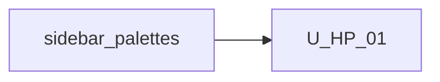

# Unit of Work Dependency — Generic host-driven Properties

**Sequencing**: Single unit (plan Q1=A, Q2=A)

---

## Dependency matrix

| Unit | Depends on | Dependency type | Notes |
|---|---|---|---|
| U-HP-01 | Properties panel (`wb-right-sidebar`) | Soft / change | First-win render/save; General stays |
| U-HP-01 | `getAtPath` / `setAtPath` | Soft / reuse | Paths relative to `node.data` |
| U-HP-01 | `provideWorkflowBuilderUi` | Soft / change | Add `properties` adapter (catalog tokens unchanged) |
| U-HP-01 | Palette drop (`node.factory`, U-HPI / U-LIM) | Soft / change | Copy `propertiesSchema` + `taskMeta`; `metadata` / icons unchanged |
| U-HP-01 | Logic built-ins + connector UI | Soft / reuse | Fallback schemas; edges/connectors not redesigned |

No second unit in this increment.

---

## Sequence

```text
Properties panel + palettes COMPLETE --> U-HP-01 (FD -> CG -> Build/Test)
```

Text alternative: One construction unit after the existing sidebar and palette overlay. Functional Design, Code Generation, then Build and Test.



Text alternative: U-HP-01 depends on the shipped Properties panel and palette drop. No reverse edge.

---

## Shared resources

| Resource | Owner | U-HP-01 use |
|---|---|---|
| `wb-right-sidebar` General + Save | existing | Keep; add schema sections |
| `config-path` | existing | Field path IO |
| Catalog adapter DI | U-PAL-02 | Unchanged; properties adapter is a separate token |
| `[palettes]` overlay | U-HPI / U-LIM | May carry `propertiesSchema` on items |
| Embed guide | prior increments | Add properties schema + adapter |

---

## Non-dependencies

- No new microservice or deployable
- No `PropertiesSchemaService` injectable (App Design Q2=A)
- No async properties adapter
- Sidebar must not import `collectEnsoTaskFields`
- Factory must not write `ensoTask`
- No circular import between resolver and sidebar (sidebar calls pure resolve)
