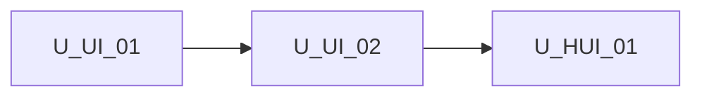

# Unit of Work Dependency — Host UI chrome inputs (`[ui]`)

**Sequencing**: Single unit (plan Q2=A)

---

## Dependency matrix

| Unit | Depends on | Dependency type | Notes |
|---|---|---|---|
| U-HUI-01 | **U-UI-01** | Soft / reuse (already shipped) | `mergeUiFeatures`, types, `UiConfigService` bootstrap |
| U-HUI-01 | **U-UI-02** | Soft / reuse (already shipped) | Existing chrome `@if` / action gates to re-point at effective |
| U-HUI-01 | `ShellLayoutComponent`, `AgentSkillsShellComponent` | Soft / extend | `ui` input + token provider |
| U-HUI-01 | TopBar / ChromeShortcuts / ZoomControls / CanvasViewport | Soft / extend | Inject `UI_EFFECTIVE_FEATURES` |

No second unit in this increment.

---

## Sequence

```text
U-UI-01 COMPLETE --> U-UI-02 COMPLETE --> U-HUI-01 (FD -> CG -> Build/Test)
```

Text alternative: Host UI chrome inputs is one construction unit after UI Configurability. Functional Design, Code Generation, then Build and Test.



Text alternative: U-HUI-01 depends on completed U-UI-01 and U-UI-02. No reverse edge.

---

## Shared resources

| Resource | Owner | U-HUI-01 use |
|---|---|---|
| `UiFeatures` / `UiFeaturesPartial` | U-UI-01 | Input and merge types |
| `mergeUiFeatures` | U-UI-01 | Shell-local effective = global ⊕ `[ui]` |
| `UiConfigService` | U-UI-01 | Read `features()` only; never write instance overlay |
| Chrome gates (shell/agent/canvas) | U-UI-02 | Consume effective token instead of bootstrap-only |
| Embed guide | U-UI-02 (extend) | Add `[ui]` section |

---

## Non-dependencies

- No new microservice or deployable
- ui-config must not import shell/canvas components
- Instance overlay must not mutate root `UiConfigService` (FR-HUI-05)
- No hard wait on re-running U-UI-02 Build/Test as a gate (reuse shipped chrome)
- No circular import: token/helpers stay in `core/ui-config/`
