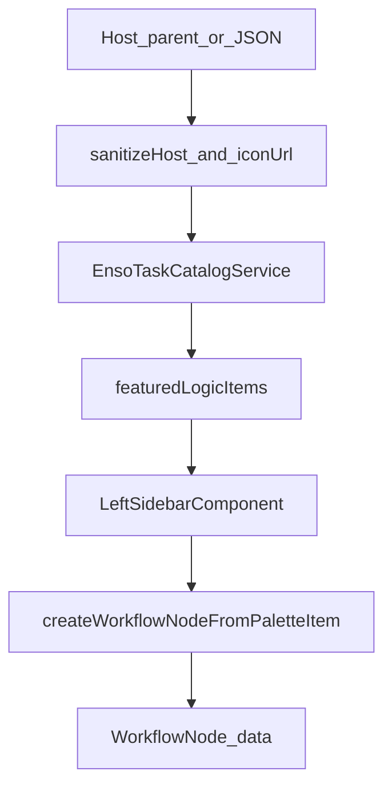

# Component Dependency — Host logic extras + agent metadata

---

## Dependency matrix

| Consumer | Depends on | Relationship |
|---|---|---|
| `sanitizeHostPaletteItems` / `sanitizeHostDefaultAgents` | `sanitizeIconUrl` | Call |
| `normalizeDefaultAgentCards` | `sanitizeIconUrl` | Call |
| `defaultAgentCardToPaletteItem` | card extras | Copy fields |
| `EnsoTaskCatalogService` | host helpers, `FEATURED_PALETTE_TYPES` | Compose omit static logic when host palettes present |
| `LeftSidebarComponent` | `featuredLogicItems`, item icon fields | Render |
| `createWorkflowNodeFromPaletteItem` | `PaletteItem.metadata` / `taskMeta` | Drop copy |
| Docs | public types | Examples |

**Non-dependency**: No new injectable. Sidebar does not import Enso. Canvas nodes do not import `icon-url.ts`.

---

## Communication patterns

- **Pure functions** for sanitize, featured selection, drop copy.
- **Existing input binding**: parent → shell → sidebar → `loadCatalog`.
- **No event bus**.

---

## Data flow

Text alternative: Host or JSON cards go through sanitizers. Catalog compose may drop static featured types. The sidebar uses featuredLogicItems and icons. Drop goes through the node factory into node.data.

---

## Unit mapping

| Unit | Owns |
|---|---|
| **U-LIM-01** | Types, icon-url, host sanitizers, featured helper, compose omit, sidebar icons, factory metadata, docs (US-LIM-01..04) |

**Sequence**: Single unit.

---

## Coupling notes

- Store only sanitized `iconUrl` on items; never bind raw host strings to `img src`.
- `hostPalettesPresent` for the helper must match compose (present non-empty after sanitize), not merely `palettes() !== undefined` when the array is empty (empty-remote already hides the strip).
