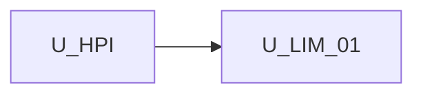

# Unit of Work Dependency — Host logic extras + agent metadata

**Sequencing**: Single unit (plan Q1=A, Q2=A)

---

## Dependency matrix

| Unit | Depends on | Dependency type | Notes |
|---|---|---|---|
| U-LIM-01 | **U-HPI** (host `[palettes]` / `[defaultAgents]`) | Soft / reuse (already shipped) | Overlay load path |
| U-LIM-01 | `palette-host.helpers`, `PaletteItem` | Soft / extend | Sanitize extras |
| U-LIM-01 | `EnsoTaskCatalogService` compose | Soft / extend | Omit static featured types |
| U-LIM-01 | `LeftSidebarComponent` | Soft / extend | Strip + icons |
| U-LIM-01 | `createWorkflowNodeFromPaletteItem` | Soft / extend | `data.metadata` |

No second unit in this increment.

---

## Sequence

```text
U-HPI COMPLETE --> U-LIM-01 (FD -> CG -> Build/Test)
```

Text alternative: One construction unit after host palette inputs. Functional Design, Code Generation, then Build and Test.



Text alternative: U-LIM-01 depends on completed host palette inputs. No reverse edge.

---

## Shared resources

| Resource | Owner | U-LIM-01 use |
|---|---|---|
| `[palettes]` / `[defaultAgents]` overlay | U-HPI | Presence drives featured replace |
| `sanitizeHostPaletteItems` | U-HPI | Keep icon + metadata + taskMeta |
| `FEATURED_PALETTE_TYPES` | palette.catalog | Compose omit when host palettes present |
| `createWorkflowNodeFromPaletteItem` | node.factory | Add `data.metadata` |
| Embed guide | U-HPI / U-HUI (extend) | Extra logic, icons, metadata |

---

## Non-dependencies

- No new microservice or deployable
- `icon-url.ts` must not import shell/canvas
- Canvas must not render host `iconUrl`
- No circular import: helpers stay in `core/domain/`
