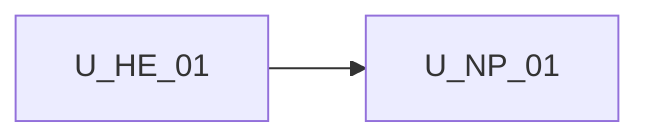

# Unit of Work Dependency — npm package publish

**Sequencing**: Single unit (plan Q1=A, Q2=A)

---

## Dependency matrix

| Unit | Depends on | Dependency type | Notes |
|---|---|---|---|
| U-NP-01 | U-HE-01 embed contract | Soft / reuse | Shells, persist, `[document]`, height 100% already shipped |
| U-NP-01 | `src/app` builder sources | Soft / extract | Library re-exports or moves public surface |
| U-NP-01 | Angular 20 + CDK | Soft / peer | Host supplies; do not bundle |
| U-NP-01 | Embed docs | Soft / change | Install from package name |
| U-NP-01 | SPA app project | Soft / keep | Demo still builds and tests |

No second unit in this increment.

---

## Sequence

```text
U-HE-01 embed contract COMPLETE --> U-NP-01 (CG -> Build/Test)
```

Text alternative: One construction unit after shipped host embed. Code Generation, then Build and Test. Functional Design skipped.



Text alternative: U-NP-01 depends on shipped U-HE-01. No reverse edge.

---

## Shared resources

| Resource | Owner | U-NP-01 use |
|---|---|---|
| `wb-shell-layout` / `wb-agent-skills-shell` | existing | Public exports |
| `provideWorkflowBuilderUi` | existing | Public export |
| `WorkflowFacade` | existing | Public export |
| `src/styles.css` / tokens | existing | Ship or document |
| Embed guide | prior increments | Package install path |

---

## Non-dependencies

- No new microservice or cloud deployable
- No `npm publish` this increment
- No library-only conversion (plan Q3=A)
- No Properties/palettes/logic-node product changes
- `src/app/try/` stays gitignored and out of the tarball
