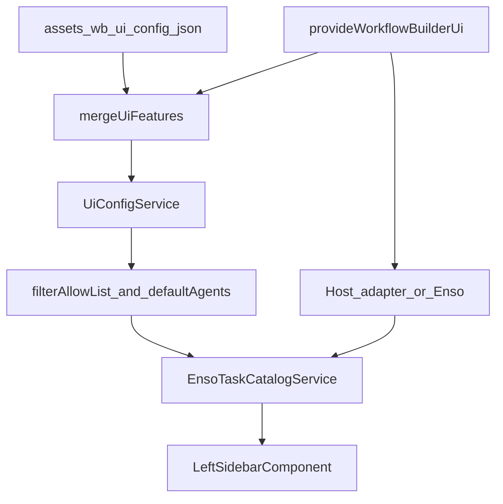

# Component Dependency — Palette / catalog host config (v1)

---

## Dependency matrix

| Consumer | Depends on | Relationship |
|---|---|---|
| APP_INITIALIZER | HttpClient, UiConfigService, features token | Loads JSON including `palette` |
| `provideWorkflowBuilderUi` | Features token + catalog tokens | Host overlay + optional adapters |
| UiConfigService | merge pure module, features token | Owns resolved chrome + palette |
| filter / resolveDefaultAgents | `UiFeatures.palette` shape, `PaletteItem` | Pure; no Angular |
| EnsoTaskCatalogService | UiConfigService, optional catalog tokens, Enso HTTP, filter helpers | Orchestrates load + filter |
| Host adapter | Host HTTP / composition | Replaces Enso for one canvas |
| LeftSidebarComponent | EnsoTaskCatalogService | Renders filtered items; no allow-list re-filter |
| ShellLayout / AgentSkillsShell | UiConfigService | Library **mount** flags only |
| Host app (external) | `provideWorkflowBuilderUi` | Documented embed API |

**Non-dependency**: Sidebar does **not** apply FR-PAL-02 itself (Q3=A). Catalog does **not** import `WorkflowFacade`. Merge stays framework-free for PBT.

---

## Communication patterns

- **Push at bootstrap**: JSON + provider features → `UiConfigService`.
- **Pull at catalog load**: service reads `features().palette` when `loadCatalog` runs (and if JSON focus-reload updates features, next load sees them).
- **Replace, not wrap**: host adapter **replaces** Enso for that canvas; WB does not call both.
- **No event bus** for palette config in v1.

---

## Data flow

Text alternative: JSON and the host provider merge into `UiConfigService`. Catalog load uses a host adapter or Enso, then allow-list and defaultAgents helpers, then `EnsoTaskCatalogService` emits items to `LeftSidebarComponent`.

---

## Unit mapping

| Unit | Owns |
|---|---|
| **U-PAL-01** | `palette` types, merge presence semantics, `filterPaletteItemsByAllowList`, `resolveDefaultAgents`, unit + PBT tests (US-PAL-01..04) |
| **U-PAL-02** | Catalog tokens + `provideWorkflowBuilderUi.catalog`, Enso as default, drop mocks, sidebar strip/0..N defaults, embed docs + examples (US-PAL-05..07) |

**Sequence**: U-PAL-01 then U-PAL-02.

---

## Coupling notes

- Keep filter/defaultAgents **pure** (PBT-02/03/07/08/09 as applicable to these helpers).
- LeftSidebar must not call `blankAgentPaletteItem()` as a bypass when `AIAgent` is disallowed.
- `MOCK_SOLUTION_AGENTS` must not be composed on any success or failure path after U-PAL-02.
- Chrome `agentsLibrary` / `skillsLibrary` remain independent of allow-list `[]` (empty library body vs hidden panel).
