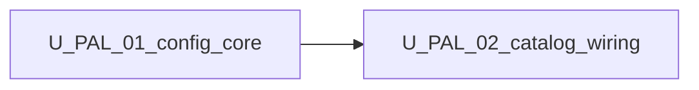

# Unit of Work Dependency — Palette / catalog host config (v1)

**Sequencing**: Strict (plan Q2=A)

---

## Dependency matrix

| Unit | Depends on | Dependency type | Notes |
|---|---|---|---|
| U-PAL-01 | U-UI-01 `UiConfigService` / merge | Soft / reuse | Extends existing config tree |
| U-PAL-01 | `palette.catalog` types | Soft / reuse | `PaletteItem`, featured type keys |
| U-PAL-02 | **U-PAL-01** | **Hard / strict** | Needs palette merge + filter + `resolveDefaultAgents` |
| U-PAL-02 | `EnsoTaskCatalogService`, `LeftSidebarComponent` | Soft / reuse | Wiring and render |

---

## Sequence

```text
U-PAL-01 (FD -> CG -> Build/Test) --approved--> U-PAL-02 (FD -> CG -> Build/Test)
```

Text alternative: Complete and approve U-PAL-01 Build and Test before starting U-PAL-02 Functional Design.



Text alternative: U-PAL-02 depends on U-PAL-01. No reverse edge.

---

## Shared resources

| Resource | Owner unit | Consumers |
|---|---|---|
| `UiFeatures.palette` + merge presence | U-PAL-01 | U-PAL-02 catalog |
| `filterPaletteItemsByAllowList` | U-PAL-01 | U-PAL-02 catalog |
| `resolveDefaultAgents` | U-PAL-01 | U-PAL-02 catalog + sidebar (via catalog items) |
| Catalog tokens / `provideWorkflowBuilderUi.catalog` | U-PAL-02 | Host app / tests |
| `EnsoTaskCatalogService` orchestration | U-PAL-02 | Left sidebar |
| Example JSON + embed docs | U-PAL-02 | External hosts |

---

## Non-dependencies

- No new microservice or deployable between units
- No circular dependency: domain helpers must not import catalog service or sidebar
- ui-config must not import `LeftSidebarComponent`
- Chrome `agentsLibrary` / `skillsLibrary` remain U-UI-02; this increment does not re-own those flags
