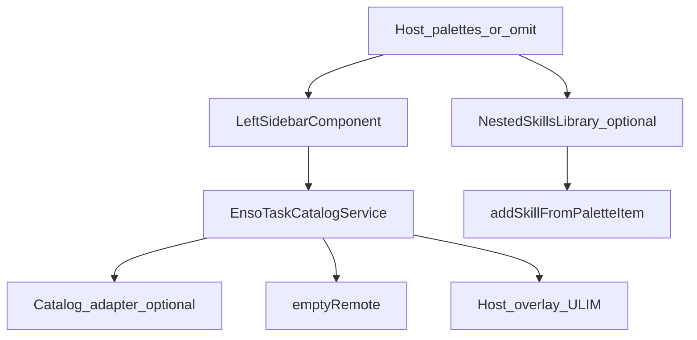

# Component Dependency — Remove APIs and dummy data

---

## Dependency matrix

| Consumer | Depends on | Relationship |
|---|---|---|
| `EnsoTaskCatalogService` | Host helpers, catalog adapter tokens, `UiConfigService` palette allow-list | Compose; **no** HttpClient; **no** Enso mappers |
| `LeftSidebarComponent` | `loadCatalog` | Existing input forwarding |
| `NestedSkillsLibraryComponent` | `sanitizeHostPaletteItems`, `WorkflowFacade.addSkillFromPaletteItem` | Palettes input |
| `WorkflowFacade.addSkillToAgent` | Agent node only | No mock catalog |
| Repeater schema / right-sidebar | — | Empty options; no mock catalog |
| Docs | public `[palettes]` contract | Examples without secrets |

**Non-dependency**: Catalog service does not import `environment` catalog URLs. Nested library does not import `MOCK_SKILLS`. Right-sidebar does not import `repeater-mock.catalog`. `enso-task-form` stays for Properties.

---

## Communication patterns

- **Existing input binding**: parent → shell → left sidebar → `loadCatalog`.
- **Optional input**: host → `wb-nested-skills-library [palettes]` (not in shell template).
- **No Enso HTTP**. Adapter is optional DI, not HTTP inside the catalog service.
- **No event bus**.

---

## Data flow

Text alternative: Host palettes or omit go to the left sidebar and catalog service. The service uses host overlay, optional adapter, or empty-remote. Nested library may receive the same palettes and add skills via the facade. Repeater Properties has empty pickers.

---

## Unit mapping

| Unit | Owns |
|---|---|
| **U-RAD-01** | HTTP/env/proxy removal, empty omit, nested palettes conversion, MOCK_SKILLS delete, Repeater mocks delete, docs (US-RAD-01..04) |

**Sequence**: Single unit.

---

## Coupling notes

- Empty-omit must not call compose with static featured types (PBT Partial: omit-without-adapter never emits Enso or static featured rows).
- Adapter-failure path must not be reused for omit-without-adapter (Q2=A).
- Do not store catalog credentials in `environment.ts`.
