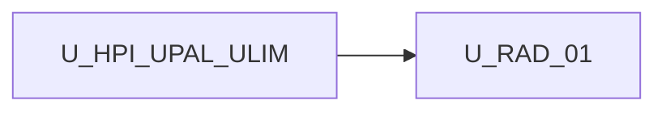

# Unit of Work Dependency — Remove APIs and dummy data

**Sequencing**: Single unit (plan Q1=A, Q2=A)

---

## Dependency matrix

| Unit | Depends on | Dependency type | Notes |
|---|---|---|---|
| U-RAD-01 | **U-HPI** (`[palettes]` overlay) | Soft / reuse (shipped) | Present items still overlay; omit path changes to empty-remote |
| U-RAD-01 | **U-PAL-02** catalog adapter tokens | Soft / reuse (shipped) | Adapter-when-omit kept; adapter failure unchanged (Q2=A App Design) |
| U-RAD-01 | **U-LIM-01** featured replace | Soft / reuse (shipped) | When palettes present non-empty, static featured still omitted |
| U-RAD-01 | `EnsoTaskCatalogService` | Soft / change | Strip HTTP; empty-omit |
| U-RAD-01 | `NestedSkillsLibraryComponent` | Soft / change | Palettes input |
| U-RAD-01 | Repeater Properties | Soft / change | Empty options |

No second unit in this increment.

---

## Sequence

```text
U-HPI / U-PAL-02 / U-LIM COMPLETE --> U-RAD-01 (FD -> CG -> Build/Test)
```

Text alternative: One construction unit after host palettes, catalog adapter, and logic-icons. Functional Design, Code Generation, then Build and Test.



Text alternative: U-RAD-01 depends on completed host palette, adapter, and logic-icons units. No reverse edge.

---

## Shared resources

| Resource | Owner | U-RAD-01 use |
|---|---|---|
| `loadCatalog` / `hostPalettes` | U-HPI | Omit-without-adapter becomes empty-remote |
| Catalog adapter DI | U-PAL-02 | Keep when palettes omitted |
| `composeSolution` omit static featured | U-LIM-01 | Only when host palettes present non-empty |
| `sanitizeHostPaletteItems` | U-HPI / U-LIM | Nested library overlay |
| `addSkillFromPaletteItem` | facade | Nested Add |
| Embed guide | prior increments | Empty-when-omit; no Enso/proxy/Bearer |

---

## Non-dependencies

- No new microservice or deployable
- Catalog service must not inject HttpClient
- Nested library must not import `MOCK_SKILLS`
- Right-sidebar must not import `repeater-mock.catalog`
- `enso-task-form.ts` is not deleted
- No circular import between nested library and catalog service (nested uses palettes input + facade)
