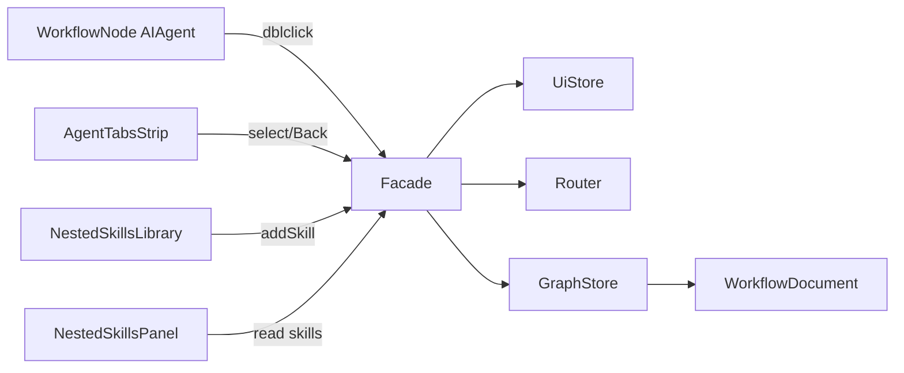

# Component Dependencies — Solution Workflow Increment

---

## Dependency matrix

| Consumer | Depends on | Coupling |
|---|---|---|
| WorkflowNodeComponent | WorkflowFacade.openAgentTab | Event → facade |
| AgentTabsStrip / TopBar | Facade tabs + Router navigate / Back | UI → facade |
| NestedSkillsLibrary | Mock catalog + Facade.addSkillToAgent | Read catalog / command |
| NestedSkillsPanel | Facade.agentSkills / selection | Read model |
| RightSidebar (nested) | UiStore selection + GraphStore node/skill focus | Existing pattern |
| WorkflowFacade | GraphStore, UiStore, Router, agent-skills pure | Orchestration |
| GraphStore | WorkflowDocument nodes (AIAgent.data.skills) | Source of truth |
| SerializationService | Unchanged; clones node.data | Passive |

---

## Communication patterns

```text
Solution canvas
  dblclick AIAgent --> Facade.openAgentTab --> UiStore tabs
  tab click --------> Facade.selectAgentTab --> Router /agent/:id
                                              --> Nested shell children

Nested view
  add skill --------> Facade.addSkillToAgent --> agent-skills pure
                                            --> GraphStore patch AIAgent.data.skills

  Back -------------> Facade.navigateBackToSolution --> Router /
                                                    --> select AIAgent
```

### Text data flow

1. **Document** holds solution graph; each Blank Agent owns `data.skills[]`.
2. **Tabs** are UI state (which agents are “open”), not document fields.
3. **Route** selects which agent nested UI binds to.
4. **View mode** blocks add/remove skill at facade boundary.

---

## Mermaid (optional)



### Text alternative

- Node dblclick → Facade → UiStore tabs  
- Tab select → Facade → Router → Nested Lib/Panel  
- Add skill → Facade → pure helper → GraphStore document  
- Back → Facade → Router solution + selection restore  
