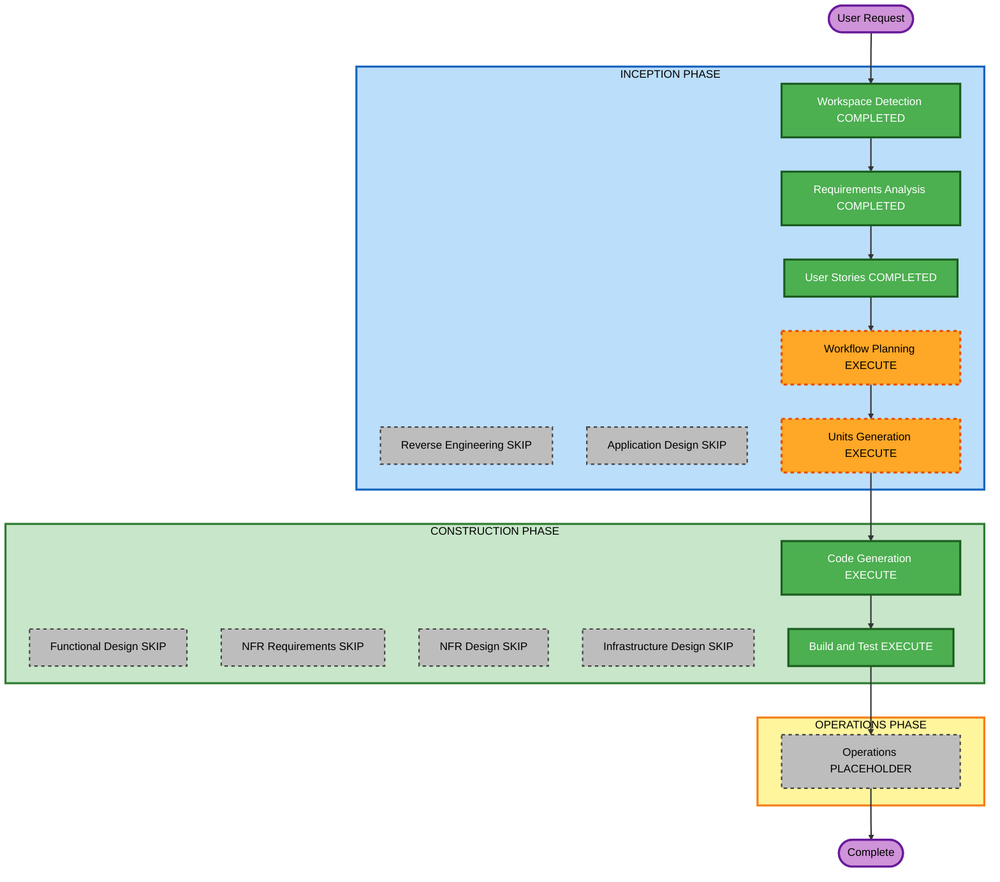

# Execution Plan — Enter agent without tab bar

**Increment**: Enter agent without tab bar  
**Requirements**: `aidlc-docs/inception/requirements/agent-enter-without-tabs-requirements.md`  
**Stories**: `aidlc-docs/inception/user-stories/agent-enter-without-tabs-stories.md` (US-AE-01..04)  
**Status**: APPROVED (Q1=A)  
**Approved**: Skip App Design and Functional Design; 1 unit; skip NFR/Infra; then CG → Build/Test  

Fill **Question 1** below, then reply in chat (for example `answered`). You may override any EXECUTE/SKIP.

Content validation: Mermaid node IDs alphanumeric; no quotes in labels; text alternative included.

---

## Detailed Analysis Summary

### Transformation Scope (Brownfield)
- **Transformation Type**: Single-package UI/navigation enhancement
- **Primary Changes**: Gate `openAgentTab` on `agentTabs.enabled`; keep double-click / chip `selectAgentTab`; nested Back/Solution when the strip is not mounted
- **Related Components**: `workflow.facade.ts`, `canvas-viewport.component.ts`, `shell-layout.component.ts`, `agent-skills-shell.component.ts`, `agent-tabs.component.ts`, `docs/workflow-builder-ui-embed.md`

### Change Impact Assessment
- **User-facing changes**: Yes — enter without tab bar; nested Back control
- **Structural changes**: No new deployable or DI token
- **Data model changes**: No
- **API changes**: Embed docs only (`agentTabs.enabled` is chrome, not a routing block)
- **NFR impact**: Fail-safe invalid agent route unchanged; PBT Partial likely N/A (UI gating)

### Component Relationships
- **Primary**: WorkflowFacade (`openAgentTab` / `selectAgentTab` / `navigateBackToSolution`)
- **Shared**: Effective UI `agentTabs.enabled`
- **Dependent**: Solution canvas dblclick; nested shell chrome
- **Supporting**: Embed docs, unit specs

| Related | Change Type | Priority |
|---|---|---|
| Facade tab vs navigate | Minor | Critical |
| Nested Back control | Minor | Critical |
| Docs | Configuration/docs | Important |

### Risk Assessment
- **Risk Level**: Low — isolated chrome vs routing
- **Rollback Complexity**: Easy (git revert)
- **Testing Complexity**: Simple (flag on/off enter/exit)

### Module Update Strategy
- **Update Approach**: Sequential single package (Angular SPA)
- **Critical Path**: Gate openAgentTab → nested Back control → specs/docs
- **Coordination Points**: Chip enter when bar on; nested no re-enter
- **Testing Checkpoints**: `npm test` / `npm run build`
- **Rollback**: Revert the increment commit

---

## Workflow Visualization

### Mermaid Diagram



### Text Alternative

```
INCEPTION: Workspace Detection COMPLETED -> Reverse Engineering SKIP ->
Requirements COMPLETED -> User Stories COMPLETED -> Workflow Planning EXECUTE ->
Application Design SKIP -> Units Generation EXECUTE (1 unit)

CONSTRUCTION: Functional Design SKIP -> NFR Requirements SKIP ->
NFR Design SKIP -> Infrastructure Design SKIP ->
Code Generation EXECUTE -> Build and Test EXECUTE

OPERATIONS: placeholder then Complete
```

---

## Phases to Execute

### INCEPTION PHASE
- [x] Workspace Detection (COMPLETED)
- [x] Reverse Engineering (SKIPPED)
- [x] Requirements Analysis (COMPLETED)
- [x] User Stories (COMPLETED)
- [x] Execution Plan (APPROVED Q1=A)
- [x] Application Design — **SKIP**
  - **Rationale**: Existing facade methods and shells; no new service/component type
- [x] Units Generation — **EXECUTE** — **1 unit** (U-AE-01): gate tabs vs navigate + nested Back + docs (US-AE-01..04)

### CONSTRUCTION PHASE
- [ ] Functional Design — **SKIP**
  - **Rationale**: Simple enable-flag gating; rules already locked in RA
- [ ] NFR Requirements — **SKIP**
  - **Rationale**: Security / Resiliency / PBT scoped in RA; no new stack
- [ ] NFR Design — **SKIP**
- [ ] Infrastructure Design — **SKIP**
  - **Rationale**: Client SPA
- [x] Code Generation — **EXECUTE** (ALWAYS)
- [x] Build and Test — **EXECUTE** (ALWAYS) — approved

### OPERATIONS PHASE
- [x] Operations — PLACEHOLDER

---

## Package Change Sequence

1. Skip `openAgentTab` when `agentTabs.enabled` is false (FR-AE-05)
2. Keep double-click and chip `selectAgentTab` (FR-AE-01, FR-AE-02)
3. Nested Back/Solution when strip not mounted (FR-AE-03, FR-AE-04, FR-AE-06)
4. Docs + tests (FR-AE-07, FR-AE-08)

---

## Extension compliance (this stage)

| Extension | Status | Notes |
|---|---|---|
| Security Baseline | Planned in CG | Invalid agent route still redirects; no new secrets |
| Other SECURITY | N/A | No new stores/auth/infra |
| Resiliency Baseline | Planned in CG | Fail-safe missing agent; DR N/A |
| PBT Partial | N/A this increment | No new pure transform; example tests for flag gating |

---

## Estimated Timeline
- **Total stages remaining (recommended)**: Units Generation, Code Generation, Build and Test, Operations placeholder
- **Estimated duration**: One short construction unit

## Success Criteria
- **Primary Goal**: Enter/leave nested agent without the tab bar
- **Key Deliverables**: Gated `openAgentTab`; nested Back; docs; tests
- **Quality Gates**: `npm test`; `npm run build`
- **Integration Testing**: Bar off dblclick enter + Back; bar on chips; nested no re-enter; view enter

---

## Question 1

**Approve this execution plan?**

A) **Recommended** — Skip Application Design and Functional Design; 1 unit; skip NFR/Infra; then CG → Build/Test

B) Add Application Design + Functional Design before CG (same 1 unit)

C) Skip Units Generation; one CG plan at repo root with no unit folder

X) Other (please describe after [Answer]: tag below)

[Answer]: A
