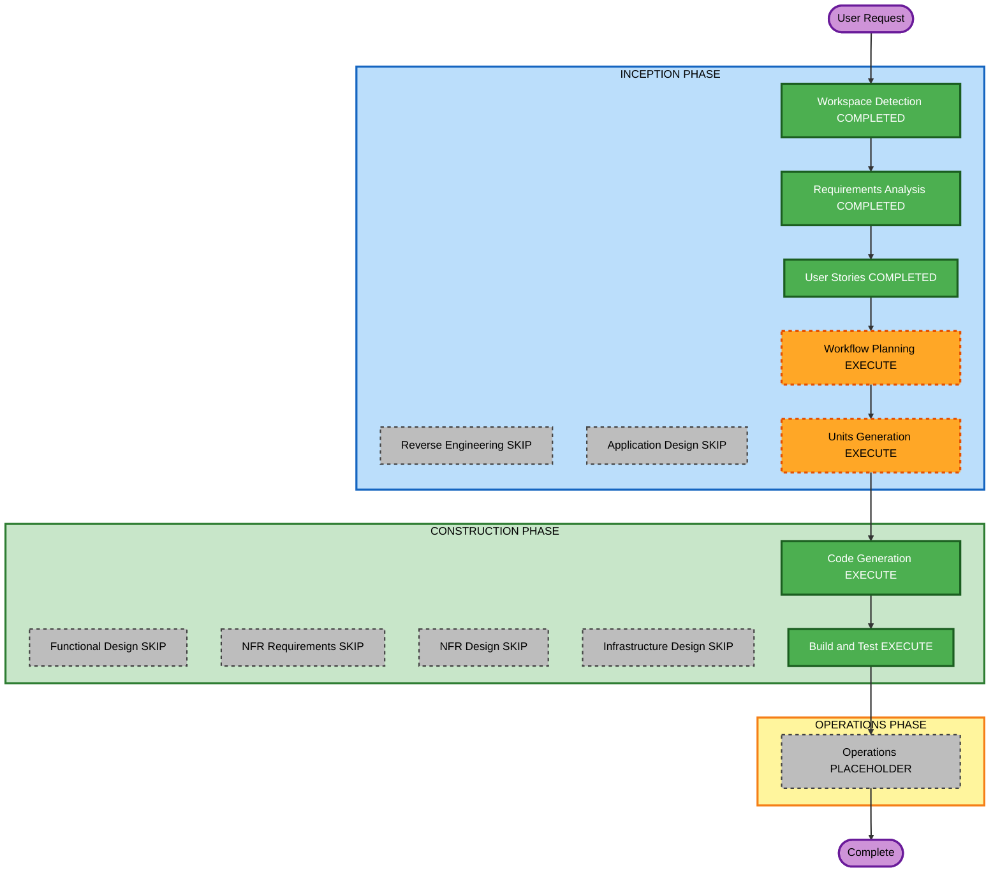

# Execution Plan — Agent tabs doubleClick config

**Increment**: More Changes R62 — `agentTabs.doubleClick`  
**Requirements**: `aidlc-docs/inception/requirements/agent-tabs-doubleclick-config-requirements.md` (FR-DC-01..08)  
**Stories**: `aidlc-docs/inception/user-stories/agent-tabs-doubleclick-config-stories.md` (US-DC-01..05)  
**Status**: APPROVED  

You may override any EXECUTE/SKIP. Content validation: Mermaid node IDs alphanumeric; no quotes in labels; text alternative included.

---

## Detailed Analysis Summary

### Transformation Scope (Brownfield)
- **Transformation Type**: Single-package UI chrome enhancement
- **Primary Changes**: Add `agentTabs.doubleClick` (default true); gate solution-canvas AIAgent dblclick; document host pass-through
- **Related Components**: `ui-features.types.ts`, merge/normalize, `canvas-viewport.component.ts` (`onNodeDblClick`), shells/`[ui]` sticky overlay, `docs/workflow-builder-ui-embed.md`, example JSON

### Change Impact Assessment
- **User-facing changes**: Yes — canvas dblclick may no longer enter
- **Structural changes**: No new deployable, DI token, or component type
- **Data model changes**: No (boolean leaf on existing `AgentTabsFeatures`)
- **API changes**: Yes — host embed contract adds `agentTabs.doubleClick` (JSON / provider / `[ui]`)
- **NFR impact**: Existing invalid-JSON fail-safe; PBT Partial on merge invariant (absent key → true)

### Component Relationships
- **Primary**: `UiFeatures.agentTabs` + canvas `onNodeDblClick`
- **Shared**: Effective UI merge (`defaults` → JSON → provider → `[ui]`)
- **Dependent**: Host embed docs; example JSON; chrome-gate specs
- **Supporting**: Nested no-re-enter (unchanged); chip click (unchanged)

| Related | Change Type | Priority |
|---|---|---|
| Feature leaf + `UI_FEATURE_PATHS` | Minor | Critical |
| Canvas dblclick gate | Minor | Critical |
| Merge/default invariant tests | Patch | Important |
| Embed docs + JSON examples | Docs | Important |

### Risk Assessment
- **Risk Level**: Low — isolated chrome leaf; default preserves today
- **Rollback Complexity**: Easy (git revert)
- **Testing Complexity**: Simple (flag matrix + merge)

### Module Update Strategy
- **Update Approach**: Sequential single package (Angular SPA + library sources)
- **Critical Path**: Types/merge → canvas gate → specs → docs/examples
- **Coordination Points**: Independent of `agentTabs.enabled`; chip click still enters
- **Testing Checkpoints**: `npm test` / `npm run build`
- **Rollback**: Revert the increment commit

---

## Workflow Visualization

### Mermaid Diagram



### Text Alternative

```
INCEPTION: Workspace Detection COMPLETED -> Reverse Engineering SKIP ->
Requirements COMPLETED -> User Stories COMPLETED -> Workflow Planning EXECUTE ->
Application Design SKIP -> Units Generation EXECUTE (1 unit)

CONSTRUCTION: Functional Design SKIP -> NFR Requirements SKIP ->
NFR Design SKIP -> Infrastructure Design SKIP ->
Code Generation EXECUTE -> Build and Test EXECUTE

OPERATIONS: placeholder then Complete
```

---

## Phases to Execute

### INCEPTION PHASE
- [x] Workspace Detection (COMPLETED)
- [x] Reverse Engineering (SKIPPED)
- [x] Requirements Analysis (COMPLETED)
- [x] User Stories (COMPLETED)
- [x] Execution Plan (APPROVED)
- [ ] Application Design — **SKIP**
  - **Rationale**: Existing `AgentTabsFeatures`, merge, canvas `onNodeDblClick`; no new component or service type
- [ ] Units Generation — **EXECUTE** — **1 unit** (U-DC-01): leaf + merge + canvas gate + docs (US-DC-01..05)

### CONSTRUCTION PHASE
- [ ] Functional Design — **SKIP**
  - **Rationale**: Boolean gate and merge rules already locked in RA
- [ ] NFR Requirements — **SKIP**
  - **Rationale**: Security / Resiliency / PBT Partial scoped in RA; no new stack
- [ ] NFR Design — **SKIP**
- [ ] Infrastructure Design — **SKIP**
  - **Rationale**: Client SPA; no infra mapping
- [ ] Code Generation — **EXECUTE** (ALWAYS)
- [ ] Build and Test — **EXECUTE** (ALWAYS)

### OPERATIONS PHASE
- [ ] Operations — PLACEHOLDER
  - **Rationale**: No deploy in this increment (npm 0.1.1 OTP is carry-over, not in scope)

---

## Package Change Sequence

1. Add `agentTabs.doubleClick` to types, defaults, `UI_FEATURE_PATHS`, JSON examples (FR-DC-01, FR-DC-02)
2. Gate solution-canvas AIAgent `onNodeDblClick` on effective flag (FR-DC-03, FR-DC-07)
3. Keep chip click and nested no-re-enter (FR-DC-04, FR-DC-05, FR-DC-06)
4. Embed docs + tests including merge invariant (FR-DC-08, PBT Partial)

---

## Extension compliance (this stage)

| Extension | Status | Notes |
|---|---|---|
| SECURITY-07 secrets | Compliant | No secrets in plan or examples |
| Other SECURITY | N/A | No new stores/auth/infra |
| Resiliency Baseline | N/A this increment | DR/HA not in scope |
| PBT Partial | Planned in CG | Merge: absent key → true; explicit false wins |

---

## Estimated Timeline
- **Total stages remaining (recommended)**: Units Generation, Code Generation, Build and Test, Operations placeholder
- **Estimated duration**: One short construction unit

## Success Criteria
- **Primary Goal**: Parent can pass `agentTabs.doubleClick`; default true
- **Key Deliverables**: Feature leaf; canvas gate; embed docs; tests
- **Quality Gates**: `npm test`; `npm run build`
- **Integration Testing**: Omit/true enters; false does not; strip independent; chips still enter; nested no re-enter
