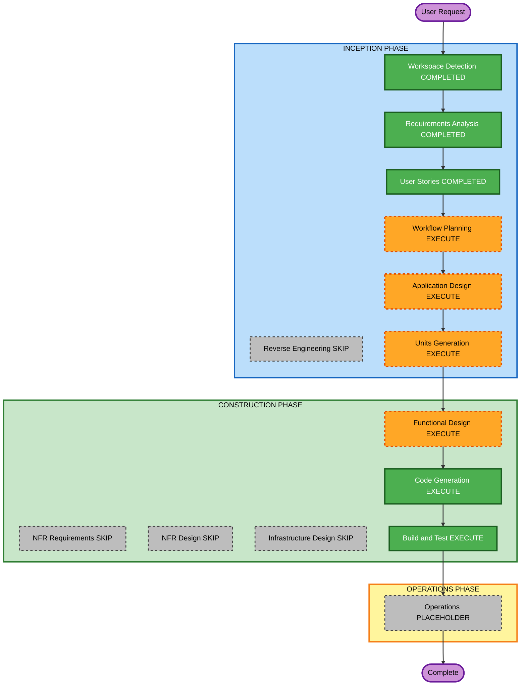

# Execution Plan — Dynamic Properties

**Increment**: Dynamic Properties  
**Requirements**: `aidlc-docs/inception/requirements/dynamic-properties-requirements.md`  
**Stories**: `aidlc-docs/inception/user-stories/dynamic-properties-stories.md` (US-DP-01..05)  
**Status**: APPROVED (Q1=A)  
**Approved**: App Design + Units (1× U-DP-01); skip NFR/Infra; FD → CG → Build/Test  

Fill **Question 1** below, then reply in chat (for example `answered`), or choose **Approve & Continue** / **Request Changes** / **Add Skipped Stages**. You may override any EXECUTE/SKIP.

Content validation: Mermaid node IDs alphanumeric; no quotes in labels; text alternative included.

---

## Detailed Analysis Summary

### Transformation Scope (Brownfield)
- **Transformation Type**: Application enhancement — extend U-HP-01 Properties with dynamic value map + inference
- **Primary Changes**: `node.data.properties` as value map; schema paths bind into that map; Dynamic Property component + inference; remaining-keys filter; built-in collision omit; `propertiesPanel.addProperty`; embed docs + try host
- **Related Components**: `host-properties.schema.ts` / resolve, `ui-features.types.ts` (chrome), `right-sidebar.component.ts`, new Dynamic Property component + pure helpers, `docs/workflow-builder-ui-embed.md`, `try-ui-host.component.ts`

### Change Impact Assessment
- **User-facing changes**: Yes — Properties shows schema + inferred dynamic keys; optional Add property
- **Structural changes**: New UI component + helpers; no new deployable service
- **Data model changes**: Canonical host/dynamic values in `node.data.properties` (migration note for hosts using top-level paths)
- **API changes**: Chrome `propertiesPanel.addProperty`; embed contract docs; no new shell output
- **NFR impact**: XSS-safe labels/values; skip-invalid; PBT Partial on inference / remaining-keys / map bind

### Component Relationships
- **Primary**: `wb-right-sidebar` (resolve + render + Save into properties map)
- **Shared**: Host schema types; UI chrome normalize; path get/set under `properties`
- **Dependent**: Logic built-in schemas (always shown; collision filter); palette/schema supply unchanged
- **Supporting**: Embed docs, try host, unit + partial PBT specs

| Related | Change Type | Priority |
|---|---|---|
| Properties map bind + Save | Major | Critical |
| Dynamic Property + inference | Major | Critical |
| Remaining-keys / built-in collision | Minor (pure helpers) | Critical |
| `propertiesPanel.addProperty` | Minor (chrome) | Important |
| Docs + try host | Docs/demo | Important |

### Risk Assessment
- **Risk Level**: Medium — hosts must migrate schema values into `node.data.properties`
- **Rollback Complexity**: Easy (git revert)
- **Testing Complexity**: Moderate (bind/save, inference, collision, addProperty flag, docs)

### Module Update Strategy
- **Update Approach**: Sequential single package (Angular SPA)
- **Critical Path**: Types/chrome → helpers (infer + remaining keys) → Dynamic Property → sidebar bind/save → docs/try/tests
- **Coordination Points**: Built-in Condition/Router/Repeater paths stay on `node.data`; host schema values move to map
- **Testing Checkpoints**: Unit + partial PBT, then `npm test` / `npm run build`
- **Rollback**: Revert the increment commit

---

## Workflow Visualization

### Mermaid Diagram



### Text Alternative

```
INCEPTION: Workspace Detection COMPLETED -> Reverse Engineering SKIP ->
Requirements COMPLETED -> User Stories COMPLETED -> Workflow Planning EXECUTE ->
Application Design EXECUTE -> Units Generation EXECUTE

CONSTRUCTION: Functional Design EXECUTE -> NFR Requirements SKIP ->
NFR Design SKIP -> Infrastructure Design SKIP ->
Code Generation EXECUTE -> Build and Test EXECUTE

OPERATIONS: placeholder then Complete
```

---

## Phases to Execute

### INCEPTION PHASE
- [x] Workspace Detection (COMPLETED)
- [x] Reverse Engineering (SKIPPED)
- [x] Requirements Analysis (COMPLETED)
- [x] User Stories (COMPLETED)
- [x] Execution Plan (APPROVED Q1=A)
- [ ] Application Design — **EXECUTE**
  - **Rationale**: New Dynamic Property component, properties-map bind rules, remaining-keys / collision helpers, chrome flag
- [ ] Units Generation — **EXECUTE** — **1 unit** (U-DP-01): helpers + component + sidebar + chrome + docs/try (US-DP-01..05)

### CONSTRUCTION PHASE
- [ ] Functional Design — **EXECUTE**
  - **Rationale**: Inference table, remaining-keys algorithm, Save shape into `properties`, built-in collision
- [ ] NFR Requirements — **SKIP**
  - **Rationale**: Security / Resiliency / PBT already scoped in RA; no new stack or SLA; enforce in FD/CG
- [ ] NFR Design — **SKIP**
  - **Rationale**: Follows skipped NFR Requirements
- [ ] Infrastructure Design — **SKIP**
  - **Rationale**: Client SPA; no cloud resources
- [ ] Code Generation — **EXECUTE** (ALWAYS)
- [ ] Build and Test — **EXECUTE** (ALWAYS)

### OPERATIONS PHASE
- [ ] Operations — PLACEHOLDER

---

## Package Change Sequence

1. Chrome: `propertiesPanel.addProperty` default false (FR-DP-06)
2. Pure helpers: inference, remaining keys, built-in collision (FR-DP-03, FR-DP-05)
3. Dynamic Property component (FR-DP-02)
4. Right-sidebar: schema bind to `node.data.properties` + inferred keys + Save (FR-DP-01, FR-DP-04, FR-DP-07)
5. Docs + try host (FR-DP-08, FR-DP-09)
6. Unit + partial PBT (NFR-DP-01..03)

---

## Extension compliance (this stage)

| Extension | Status | Notes |
|---|---|---|
| Security Baseline | Planned in FD/CG | No HTML injection; vendor-neutral API; infra rules N/A |
| Other SECURITY | N/A | No new stores/auth/infra |
| Resiliency Baseline | Planned in FD/CG | Skip-invalid; safe coerce; DR N/A |
| PBT Partial | Planned in FD/CG | Inference; remaining-keys; map bind round-trip |

---

## Estimated Timeline
- **Total stages remaining (recommended)**: Application Design, Units Generation, Functional Design, Code Generation, Build and Test, Operations placeholder
- **Estimated duration**: One construction unit after design

## Success Criteria
- **Primary Goal**: Host/dynamic Properties via `node.data.properties` without library-hardcoded keys
- **Key Deliverables**: Map bind/save; Dynamic Property + inference; built-in collision; addProperty chrome; docs/try; tests
- **Quality Gates**: Unit + partial PBT; `npm test`; `npm run build`
- **Integration Testing**: Schema+extras; Condition built-in + dynamic; addProperty off/on; try host demo

---

## Question 1

**Approve this execution plan?**

A) **Recommended** — Application Design + Units (1 unit U-DP-01); skip NFR/Infra; then FD → CG → Build/Test

B) Skip Application Design; go Units → Construction

C) Split into 2 units (bind+inference vs addProperty+docs)

X) Other (please describe after [Answer]: tag below)

[Answer]: A
