# Execution Plan — Angular Workflow Builder

## Detailed Analysis Summary

### Transformation Scope
- **Project type**: Greenfield (N/A for brownfield transformation)
- **Primary changes**: New Angular SPA with custom SVG+HTML graph engine
- **Related components**: None existing

### Change Impact Assessment
- **User-facing changes**: Yes — entire editor UX (shell, canvas, palette, properties, run, theme, view mode)
- **Structural changes**: Yes — new application architecture (feature modules + signal store + canvas engine)
- **Data model changes**: Yes — in-memory workflow model (nodes, edges, schemas, history snapshots); no database
- **API changes**: No — no backend APIs
- **NFR impact**: Yes — canvas interaction performance, import validation, PBT for serialize/deserialize; resiliency mostly N/A (Low criticality, no DR)

### Risk Assessment
- **Risk Level**: Medium (custom canvas from scratch; mitigated by phased gates and Phase 1-only first delivery)
- **Rollback Complexity**: Easy (greenfield; discard/replace code)
- **Testing Complexity**: Moderate (unit + PBT for graph pure functions; UI interaction checks per phase)

### Construction Constraint (User-Confirmed)
- After planning/design units are approved, **Code Generation delivers Phase 1 only**, then stops for explicit review before Phase 2+
- Phase 7 routing complexity and Phase 8 layout approach remain stop-and-ask gates

---

## Workflow Visualization

### Mermaid Diagram

```mermaid
flowchart TD
    Start(["User Request"])

    subgraph INCEPTION["INCEPTION PHASE"]
        WD["Workspace Detection<br/>COMPLETED"]
        RE["Reverse Engineering<br/>SKIP"]
        RA["Requirements Analysis<br/>COMPLETED"]
        US["User Stories<br/>COMPLETED"]
        WP["Workflow Planning<br/>EXECUTE"]
        AD["Application Design<br/>EXECUTE"]
        UG["Units Generation<br/>EXECUTE"]
    end

    subgraph CONSTRUCTION["CONSTRUCTION PHASE"]
        FD["Functional Design<br/>EXECUTE"]
        NFRA["NFR Requirements<br/>EXECUTE"]
        NFRD["NFR Design<br/>EXECUTE"]
        ID["Infrastructure Design<br/>SKIP"]
        CG["Code Generation<br/>EXECUTE Phase 1 only"]
        BT["Build and Test<br/>EXECUTE"]
    end

    subgraph OPERATIONS["OPERATIONS PHASE"]
        OPS["Operations<br/>PLACEHOLDER"]
    end

    Start --> WD
    WD --> RE
    RE --> RA
    WD --> RA
    RA --> US
    US --> WP
    WP --> AD
    AD --> UG
    UG --> FD
    FD --> NFRA
    NFRA --> NFRD
    NFRD --> ID
    ID --> CG
    NFRD --> CG
    CG --> BT
    BT --> OPS
    BT --> EndNode(["Complete Phase 1 Gate"])

    style WD fill:#4CAF50,stroke:#1B5E20,stroke-width:3px,color:#fff
    style RA fill:#4CAF50,stroke:#1B5E20,stroke-width:3px,color:#fff
    style US fill:#4CAF50,stroke:#1B5E20,stroke-width:3px,color:#fff
    style WP fill:#FFA726,stroke:#E65100,stroke-width:3px,stroke-dasharray: 5 5,color:#000
    style AD fill:#FFA726,stroke:#E65100,stroke-width:3px,stroke-dasharray: 5 5,color:#000
    style UG fill:#FFA726,stroke:#E65100,stroke-width:3px,stroke-dasharray: 5 5,color:#000
    style FD fill:#FFA726,stroke:#E65100,stroke-width:3px,stroke-dasharray: 5 5,color:#000
    style NFRA fill:#FFA726,stroke:#E65100,stroke-width:3px,stroke-dasharray: 5 5,color:#000
    style NFRD fill:#FFA726,stroke:#E65100,stroke-width:3px,stroke-dasharray: 5 5,color:#000
    style CG fill:#4CAF50,stroke:#1B5E20,stroke-width:3px,color:#fff
    style BT fill:#4CAF50,stroke:#1B5E20,stroke-width:3px,color:#fff
    style RE fill:#BDBDBD,stroke:#424242,stroke-width:2px,stroke-dasharray: 5 5,color:#000
    style ID fill:#BDBDBD,stroke:#424242,stroke-width:2px,stroke-dasharray: 5 5,color:#000
    style OPS fill:#BDBDBD,stroke:#424242,stroke-width:2px,stroke-dasharray: 5 5,color:#000
    style Start fill:#CE93D8,stroke:#6A1B9A,stroke-width:3px,color:#000
    style EndNode fill:#CE93D8,stroke:#6A1B9A,stroke-width:3px,color:#000
    style INCEPTION fill:#BBDEFB,stroke:#1565C0,stroke-width:3px,color:#000
    style CONSTRUCTION fill:#C8E6C9,stroke:#2E7D32,stroke-width:3px,color:#000
    style OPERATIONS fill:#FFF59D,stroke:#F57F17,stroke-width:3px,color:#000

    linkStyle default stroke:#333,stroke-width:2px
```



### Text Alternative
```
INCEPTION
- Workspace Detection: COMPLETED
- Reverse Engineering: SKIP (greenfield)
- Requirements Analysis: COMPLETED
- User Stories: COMPLETED
- Workflow Planning: EXECUTE (this stage)
- Application Design: EXECUTE
- Units Generation: EXECUTE

CONSTRUCTION (per unit; first code delivery = Phase 1 only)
- Functional Design: EXECUTE
- NFR Requirements: EXECUTE
- NFR Design: EXECUTE
- Infrastructure Design: SKIP (no cloud/backend infra)
- Code Generation: EXECUTE (Phase 1 scope gate)
- Build and Test: EXECUTE

OPERATIONS
- Operations: PLACEHOLDER
```

---

## Phases to Execute

### INCEPTION PHASE
- [x] Workspace Detection (COMPLETED)
- [x] Reverse Engineering (SKIPPED — greenfield)
- [x] Requirements Analysis (COMPLETED)
- [x] User Stories (COMPLETED)
- [x] Workflow Planning (IN PROGRESS — awaiting approval)
- [ ] Application Design — **EXECUTE**
  - **Rationale**: New shell, canvas engine, palette, properties, store, history, theme services and dependencies must be designed before coding
- [ ] Units Generation — **EXECUTE**
  - **Rationale**: Complex state model + multi-feature decomposition; units should align to build Phases 1–10 with Phase 1 as first construction unit

### CONSTRUCTION PHASE
- [ ] Functional Design — **EXECUTE** (per unit)
  - **Rationale**: Workflow graph model, schemas, selection/history rules need explicit design
- [ ] NFR Requirements — **EXECUTE** (per unit)
  - **Rationale**: Canvas performance targets, PBT framework selection (Partial PBT), import validation; stack confirmation
- [ ] NFR Design — **EXECUTE** (per unit)
  - **Rationale**: Incorporate NFR patterns from NFR Requirements into unit design
- [ ] Infrastructure Design — **SKIP**
  - **Rationale**: Frontend-only mock app; no cloud resources, deploy topology, or backend services in scope; DR = N/A
- [ ] Code Generation — **EXECUTE** (ALWAYS)
  - **Rationale**: Implementation required; **first delivery limited to Phase 1** (scaffold, shell, tokens, mock seed)
- [ ] Build and Test — **EXECUTE** (ALWAYS)
  - **Rationale**: Build instructions and tests for delivered unit(s)

### OPERATIONS PHASE
- [ ] Operations — PLACEHOLDER
  - **Rationale**: Future deployment/monitoring; not in current scope

---

## Proposed Unit Alignment (preview for Units Generation)

| Unit | Build phases covered | First delivery? |
|---|---|---|
| Unit 1 — App Shell & Seed Store | Phase 1 | YES — stop after this |
| Unit 2 — Canvas Engine | Phases 2–3 | After Phase 1 approval |
| Unit 3 — Palette | Phase 4 | Later |
| Unit 4 — Connections | Phase 5 (+ edge reshape) | Later |
| Unit 5 — Properties Panel | Phase 6 | Later |
| Unit 6 — Routing & Layout | Phases 7–8 (after gates) | Later |
| Unit 7 — Persistence UX & History | Phase 9 | Later |
| Unit 8 — Simulated Run + View Mode polish | Phase 10 + US-VM | Later |

Exact unit boundaries will be finalized in Units Generation (user can override).

---

## Extension Enforcement Plan

| Extension | Status | Planning impact |
|---|---|---|
| Security Baseline | Disabled | Skip enforcement; still validate import JSON shape as basic hygiene |
| Resiliency Baseline | Enabled; DR N/A | Document Low criticality; mark HA/DR/infra rules N/A; no Infrastructure Design |
| PBT Partial | Enabled | NFR Requirements must select PBT framework; Code Gen includes round-trip tests for serialize/deserialize |

---

## Estimated Timeline
- **Remaining inception stages**: Application Design → Units Generation
- **First construction slice**: Unit 1 Functional/NFR design → Code Gen Phase 1 → Build/Test → **hard stop for review**
- **Total planned AI-DLC stages to execute after this approval**: Application Design, Units Generation, then per-unit Construction loop starting with Unit 1

## Success Criteria
- **Primary Goal**: Approved plan that yields a working Phase 1 Angular shell with tokens + mock seed, then gated progression
- **Key Deliverables**: Application design, units plan, Unit 1 working code (Phase 1), build/test instructions
- **Quality Gates**: Explicit user approval at each inception stage; Phase 1 review before Phase 2 code; stop-and-ask for unlisted scope / Phase 7–8 decisions
