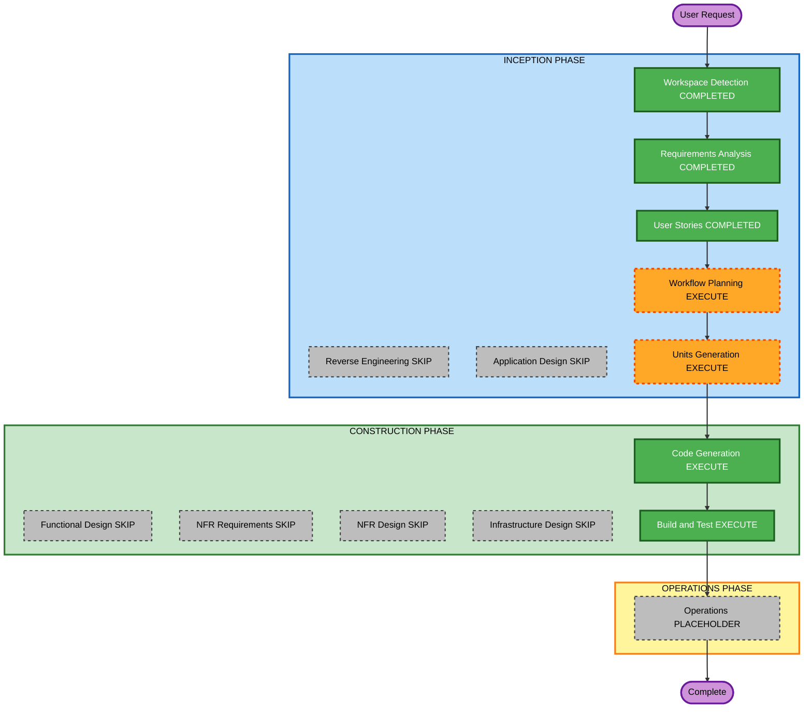

# Execution Plan — Host embed contract

**Increment**: Host embed contract  
**Requirements**: `aidlc-docs/inception/requirements/host-embed-contract-requirements.md`  
**Stories**: `aidlc-docs/inception/user-stories/host-embed-contract-stories.md` (US-HE-01..04)  
**Status**: APPROVED (Q1=A)  
**Approved**: Skip App Design and Functional Design; 1 unit; skip NFR/Infra; then CG → Build/Test  

Fill **Question 1** below, then reply in chat (for example `answered`). You may override any EXECUTE/SKIP.

Content validation: Mermaid node IDs alphanumeric; no quotes in labels; text alternative included.

---

## Detailed Analysis Summary

### Transformation Scope (Brownfield)
- **Transformation Type**: Single-package embed contract
- **Primary Changes**: `[document]` / `(documentChange)`; `loadDocument` / `getDocument` / dirty; optional Save/Run host handlers; shell `height: 100%`
- **Related Components**: `workflow.facade.ts`, `provide-workflow-builder-ui.ts`, `shell-layout.component.ts`, `agent-skills-shell.component.ts`, serialize/parse, `docs/workflow-builder-ui-embed.md`

### Change Impact Assessment
- **User-facing changes**: Yes — host can load a graph; Save/Run may call host; layout fills parent
- **Structural changes**: New persist callbacks on `provideWorkflowBuilderUi`; new shell I/O; no new deployable
- **Data model changes**: No new node types; uses existing `WorkflowDocument`
- **API changes**: Embed docs: `[document]`, `(documentChange)`, persist save/run
- **NFR impact**: Invalid load fail-safe; PBT Partial on serialize/parse

### Component Relationships
- **Primary**: WorkflowFacade (load/get/dirty/save/run dispatch)
- **Shared**: Serialize/parse; `provideWorkflowBuilderUi`
- **Dependent**: Solution shell bindings; Save/Run chrome
- **Supporting**: Embed docs, unit + parse PBT

| Related | Change Type | Priority |
|---|---|---|
| loadDocument fail-safe | Major (host contract) | Critical |
| persist.save / persist.run | Major | Critical |
| documentChange / dirty | Minor | Critical |
| height 100% | Minor | Important |
| Docs | Configuration/docs | Important |

### Risk Assessment
- **Risk Level**: Medium — Save/Run behavior splits on whether a handler is set; standalone SPA must keep download/simulate
- **Rollback Complexity**: Easy (git revert)
- **Testing Complexity**: Moderate (load fail-safe; handler vs default; height)

### Module Update Strategy
- **Update Approach**: Sequential single package (Angular SPA)
- **Critical Path**: load/get/dirty → shell I/O → Save/Run dispatch → height → docs/tests
- **Coordination Points**: Nested canvas flush before getDocument; first-win persist handler vs shell output
- **Testing Checkpoints**: `npm test` / `npm run build`
- **Rollback**: Revert the increment commit

---

## Workflow Visualization

### Mermaid Diagram



### Text Alternative

```
INCEPTION: Workspace Detection COMPLETED -> Reverse Engineering SKIP ->
Requirements COMPLETED -> User Stories COMPLETED -> Workflow Planning EXECUTE ->
Application Design SKIP -> Units Generation EXECUTE (1 unit)

CONSTRUCTION: Functional Design SKIP -> NFR Requirements SKIP ->
NFR Design SKIP -> Infrastructure Design SKIP ->
Code Generation EXECUTE -> Build and Test EXECUTE

OPERATIONS: placeholder then Complete
```

---

## Phases to Execute

### INCEPTION PHASE
- [x] Workspace Detection (COMPLETED)
- [x] Reverse Engineering (SKIPPED)
- [x] Requirements Analysis (COMPLETED)
- [x] User Stories (COMPLETED)
- [x] Execution Plan (APPROVED Q1=A)
- [x] Application Design — **SKIP**
  - **Rationale**: Extend existing shells/facade; first-win persist and fail-safe locked in RA
- [ ] Units Generation — **EXECUTE** — **1 unit** (U-HE-01): document I/O + Save/Run hooks + fill-host (US-HE-01..04)

### CONSTRUCTION PHASE
- [ ] Functional Design — **SKIP**
  - **Rationale**: Load/save/run rules already locked in RA
- [ ] NFR Requirements — **SKIP**
  - **Rationale**: Security / Resiliency / PBT scoped in RA; no new stack
- [ ] NFR Design — **SKIP**
- [ ] Infrastructure Design — **SKIP**
  - **Rationale**: Client SPA
- [ ] Code Generation — **EXECUTE** (ALWAYS)
- [ ] Build and Test — **EXECUTE** (ALWAYS)

### OPERATIONS PHASE
- [ ] Operations — PLACEHOLDER

---

## Package Change Sequence

1. Facade `loadDocument` / `getDocument` / dirty; invalid load fail-safe (FR-HE-01..03)
2. Shell `[document]` / `(documentChange)` (FR-HE-04)
3. persist.save / persist.run first-win with shell outputs; defaults keep download/simulate (FR-HE-05..07)
4. Shell `height: 100%`; embed docs (FR-HE-08, FR-HE-09)

---

## Extension compliance (this stage)

| Extension | Status | Notes |
|---|---|---|
| Security Baseline | Planned in CG | No secrets in document examples; parse fail-safe |
| Other SECURITY | N/A | No new stores/auth/infra |
| Resiliency Baseline | Planned in CG | Invalid load keeps last good; DR N/A |
| PBT Partial | Planned in CG | Serialize/parse round-trip |

---

## Estimated Timeline
- **Total stages remaining (recommended)**: Units Generation, Code Generation, Build and Test, Operations placeholder
- **Estimated duration**: One construction unit

## Success Criteria
- **Primary Goal**: Host can load/read a graph, hook Save/Run, and size the canvas to a panel
- **Key Deliverables**: Document I/O; persist handlers; fill-host CSS; docs; tests
- **Quality Gates**: `npm test`; `npm run build`
- **Integration Testing**: Valid load; invalid keep last; Save handler vs download; Run handler vs simulate; 100% height

---

## Question 1

**Approve this execution plan?**

A) **Recommended** — Skip Application Design and Functional Design; 1 unit; skip NFR/Infra; then CG → Build/Test

B) Add Application Design + Functional Design before CG (same 1 unit)

C) Skip Units Generation; one CG plan at repo root with no unit folder

X) Other (please describe after [Answer]: tag below)

[Answer]: A
