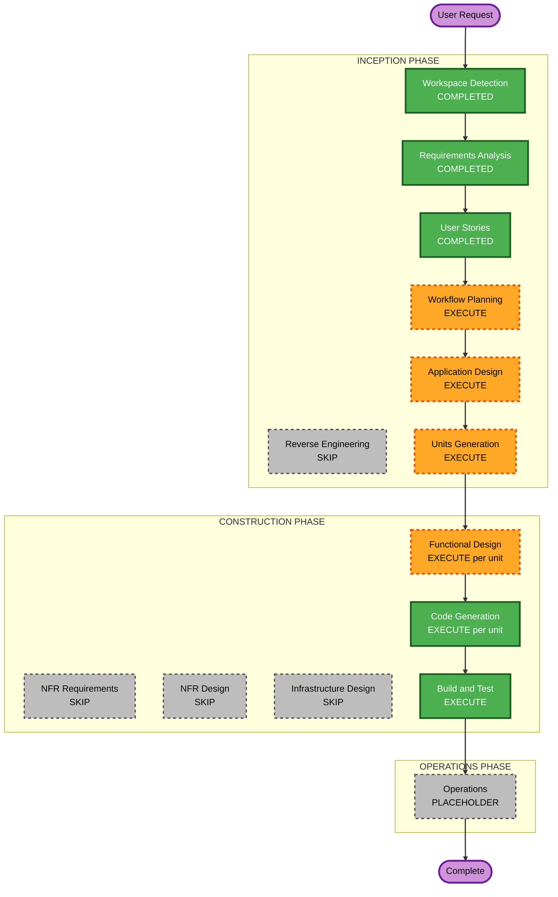

# Execution Plan — Host palette inputs (Syncfusion-style)

**Increment**: Host palette inputs  
**Requirements**: `aidlc-docs/inception/requirements/host-palette-inputs-requirements.md`  
**Stories**: `aidlc-docs/inception/user-stories/host-palette-inputs-stories.md`  
**Status**: APPROVED (Q1=A)  
**Approved**: App Design + Units; **1 unit U-HPI-01**; skip NFR/Infra  

Fill **Question 1** below, then reply in chat. You may override any EXECUTE/SKIP.

---

## Detailed Analysis Summary

### Transformation Scope (Brownfield)
- **Transformation Type**: Application feature (shell inputs + catalog source); not infrastructure
- **Primary Changes**: `[palettes]` / `[defaultAgents]` on `wb-shell-layout` and `[palettes]` on `wb-agent-skills-shell`; present input replaces Enso/provider catalog; drop unknown types; embed docs
- **Related Components**: shell layouts, `EnsoTaskCatalogService` / catalog tokens, left sidebar (already empty-remote), `docs/workflow-builder-ui-embed.md`

### Change Impact Assessment
- **User-facing changes**: Yes — parent template API; author sees parent cards / empty-state
- **Structural changes**: Minor — input → catalog source selection (no new deploy model)
- **Data model changes**: No workflow document schema change; reuse `PaletteItem`
- **API changes**: Host component inputs (in-process); no new backend
- **NFR impact**: Omit fail-open; drop unknown types; no secrets in docs; PBT Partial on omit/`[]`/drop

### Component Relationships
- **Primary**: `ShellLayoutComponent`, `AgentSkillsShellComponent`
- **Dependent**: `EnsoTaskCatalogService` (or a thin present-input adapter), `LeftSidebarComponent`
- **Supporting**: Embed markdown

### Risk Assessment
- **Risk Level**: Low–Medium (omit must preserve U-PAL-02)
- **Rollback Complexity**: Easy (omit inputs)
- **Testing Complexity**: Moderate (omit vs `[]` vs items; input vs provider; unknown type drop)

### Module Update Strategy
- **Update Approach**: Sequential single SPA
- **Critical Path**: Input presence detection before catalog load
- **Coordination Points**: Same empty-remote path as U-PAL-02 for `[]`
- **Testing Checkpoints**: Shell/catalog specs; chrome tests still green

---

## Workflow Visualization

Text alternative: Inception WD completed, RE skip, RA/US completed, WP then App Design then Units. Construction FD then Code Gen per unit, then Build and Test. NFR Requirements, NFR Design, and Infrastructure Design skip. Operations placeholder.

---

## Phases to Execute (recommendations)

### INCEPTION
- [x] Workspace Detection — COMPLETED
- [x] Reverse Engineering — SKIP (scoped increment)
- [x] Requirements Analysis — COMPLETED
- [x] User Stories — COMPLETED
- [ ] Workflow Planning — **EXECUTE** (this document)
- [ ] Application Design — **EXECUTE** — input contract, how presence is detected, catalog source order
- [ ] Units Generation — **EXECUTE** — proposed one unit below

### CONSTRUCTION (per unit)
- [ ] Functional Design — **EXECUTE**
- [ ] NFR Requirements — **SKIP** (stack fixed; Security/PBT/fail-open in FD/CG)
- [ ] NFR Design — **SKIP**
- [ ] Infrastructure Design — **SKIP** (no cloud resources)
- [ ] Code Generation — **EXECUTE**
- [ ] Build and Test — **EXECUTE** (after the unit)

### OPERATIONS
- [ ] Placeholder only

---

## Proposed units (for Units Generation)

| Unit | Scope | Stories |
|---|---|---|
| **U-HPI-01** Host palette inputs | Shell/skills `[palettes]` + solution `[defaultAgents]`; input wins over catalog provider; drop unknown types; embed docs | US-HPI-01..06 |

**Sequence**: Single unit (strict).

---

## Extension compliance (planning)

| Extension | Plan |
|---|---|
| Security | Validate item `type`; no tokens in docs |
| Resiliency | Omit fail-open; `[]` uses existing empty-remote path |
| PBT Partial | Omit vs present vs `[]`; unknown types never in output |

---

## Your control

You may **override** any EXECUTE/SKIP or unit split before we proceed.

---

## Question 1 — Approve this execution plan?

A) **Recommended** — Approve as recommended (App Design + Units; **1 unit**; skip NFR/Infra)

B) Approve but **two units** (inputs/wiring vs docs)

C) Approve but **skip Application Design** (go to Units / Functional Design)

X) Other (describe after [Answer]: tag below)

[Answer]: A
