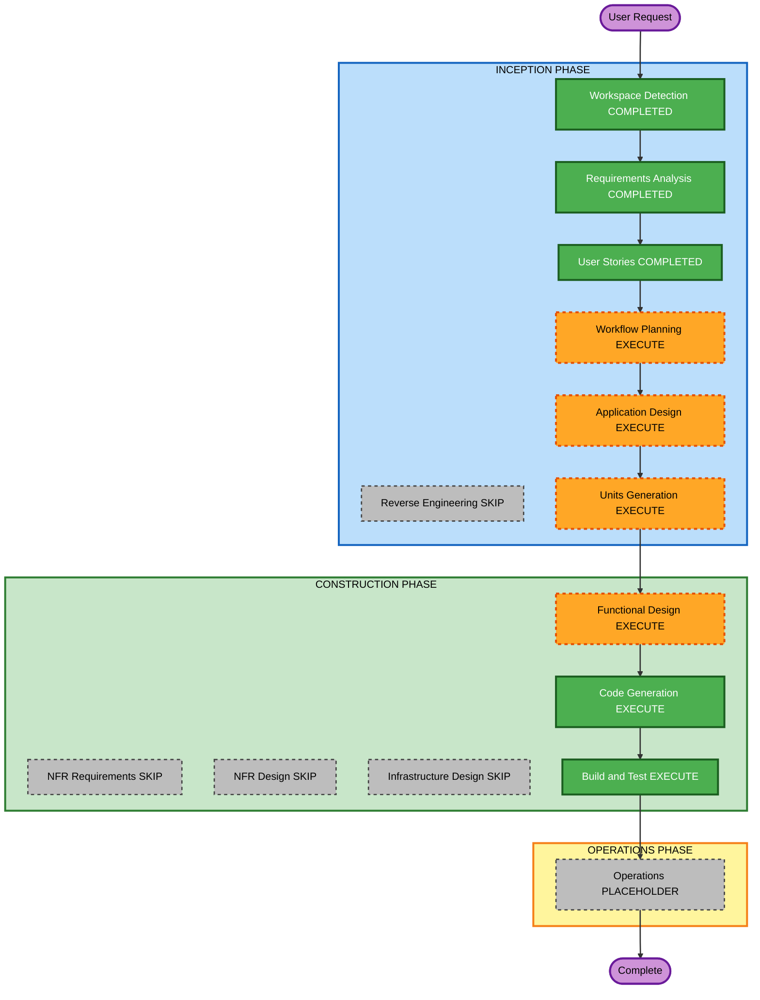

# Execution Plan — Generic host-driven Properties

**Increment**: Generic host-driven Properties  
**Requirements**: `aidlc-docs/inception/requirements/host-properties-requirements.md`  
**Stories**: `aidlc-docs/inception/user-stories/host-properties-stories.md` (US-HP-01..04)  
**Status**: APPROVED (Q1=A)  
**Approved**: App Design + Units (1× U-HP-01); skip NFR/Infra; FD → CG → Build/Test  

Fill **Question 1** below, then reply in chat (for example `answered`). You may override any EXECUTE/SKIP.

Content validation: Mermaid node IDs alphanumeric; no quotes in labels; text alternative included.

---

## Detailed Analysis Summary

### Transformation Scope (Brownfield)
- **Transformation Type**: Application enhancement — generic host Properties schema (not Enso-specific)
- **Primary Changes**: Schema types; palette/node copy of `propertiesSchema` + `taskMeta`; `provideWorkflowBuilderUi({ properties })`; first-win resolve in `wb-right-sidebar`; stop flatten / Ignore Keys; embed docs
- **Related Components**: `properties.schema.ts`, new schema domain file, `enso-task-form.ts` (stop flatten), `palette.catalog.ts`, `node.factory.ts`, `provide-workflow-builder-ui.ts`, `right-sidebar.component.ts`, `docs/workflow-builder-ui-embed.md`

### Change Impact Assessment
- **User-facing changes**: Yes — Properties shows host sections or General only; no flattened blob; no Ignore Keys
- **Structural changes**: No new deployable; add properties adapter token; keep chrome / palettes / logic edges
- **Data model changes**: `node.data.propertiesSchema`, `node.data.taskMeta` (drop no longer writes `ensoTask`)
- **API changes**: Host embed: palette `propertiesSchema`; `provideWorkflowBuilderUi({ properties })`; no Enso names in public API
- **NFR impact**: Skip unsafe paths; do not HTML-render unknown widgets; PBT Partial on sanitize / first-win / no-walk

### Component Relationships
- **Primary**: `wb-right-sidebar` (resolve + render + Save)
- **Shared**: Schema types; properties adapter; `getAtPath` / `setAtPath`
- **Dependent**: Node factory / palette drop; logic built-in schemas (fallback only)
- **Supporting**: Embed docs, unit + partial PBT specs

| Related | Change Type | Priority |
|---|---|---|
| Schema types + sanitize | Major (new contract) | Critical |
| Factory copy + stop `ensoTask` form | Major | Critical |
| Right-sidebar first-win render | Major | Critical |
| Properties adapter | Minor (DI, like catalog) | Critical |
| Docs | Configuration/docs | Important |

### Risk Assessment
- **Risk Level**: Medium — existing nodes with `data.ensoTask` lose the flatten form (intentional); hosts must supply schema for Action/Trigger fields
- **Rollback Complexity**: Easy (git revert; leftover `ensoTask` keys remain unused)
- **Testing Complexity**: Moderate (schema render/save; supply order; no-flatten; unknown widget)

### Module Update Strategy
- **Update Approach**: Sequential single package (Angular SPA)
- **Critical Path**: Types → factory copy → resolver → sidebar render/save → stop flatten → docs/tests
- **Coordination Points**: Logic built-ins and connector UI stay; catalog adapter unchanged
- **Testing Checkpoints**: Unit + partial PBT, then `npm test` / `npm run build`
- **Rollback**: Revert the increment commit

---

## Workflow Visualization

### Mermaid Diagram



### Text Alternative

```
INCEPTION: Workspace Detection COMPLETED -> Reverse Engineering SKIP ->
Requirements COMPLETED -> User Stories COMPLETED -> Workflow Planning EXECUTE ->
Application Design EXECUTE -> Units Generation EXECUTE

CONSTRUCTION: Functional Design EXECUTE -> NFR Requirements SKIP ->
NFR Design SKIP -> Infrastructure Design SKIP ->
Code Generation EXECUTE -> Build and Test EXECUTE

OPERATIONS: placeholder then Complete
```

---

## Phases to Execute

### INCEPTION PHASE
- [x] Workspace Detection (COMPLETED)
- [x] Reverse Engineering (SKIPPED)
- [x] Requirements Analysis (COMPLETED)
- [x] User Stories (COMPLETED)
- [x] Execution Plan (APPROVED Q1=A)
- [ ] Application Design — **EXECUTE**
  - **Rationale**: New schema types, properties adapter, first-win resolver, drop copy, stop flatten
- [ ] Units Generation — **EXECUTE** — **1 unit** (U-HP-01): types + factory + adapter + sidebar + docs (US-HP-01..04)

### CONSTRUCTION PHASE
- [ ] Functional Design — **EXECUTE**
  - **Rationale**: First-win, path sanitize, no-walk blob, built-in fallback vs General only
- [ ] NFR Requirements — **SKIP**
  - **Rationale**: Security / Resiliency / PBT already scoped in RA; no new stack or SLA; enforce in FD/CG
- [ ] NFR Design — **SKIP**
  - **Rationale**: Follows skipped NFR Requirements
- [ ] Infrastructure Design — **SKIP**
  - **Rationale**: Client SPA; no cloud resources
- [ ] Code Generation — **EXECUTE** (ALWAYS)
- [ ] Build and Test — **EXECUTE** (ALWAYS)

### OPERATIONS PHASE
- [ ] Operations — PLACEHOLDER

---

## Package Change Sequence

1. Generic schema types + sanitize (FR-HP-01, FR-HP-09)
2. Palette / factory copy (`propertiesSchema`, `taskMeta`) (FR-HP-03)
3. Properties adapter + first-win resolve (FR-HP-02)
4. Right-sidebar render/save; General always; no Ignore Keys (FR-HP-04..06)
5. Stop flatten; unknown widget disabled (FR-HP-07, FR-HP-08)
6. Docs + specs (FR-HP-10, NFR-HP-01..03)

---

## Extension compliance (this stage)

| Extension | Status | Notes |
|---|---|---|
| Security Baseline | Planned in FD/CG | Skip `..` paths; no blob walk; no Enso names in public API |
| Other SECURITY | N/A | No new stores/auth/infra |
| Resiliency Baseline | Planned in FD/CG | Skip-invalid; adapter absence → next source; DR N/A |
| PBT Partial | Planned in FD/CG | Skip-invalid; first-win; `taskMeta` not walked |

---

## Estimated Timeline
- **Total stages remaining (recommended)**: Application Design, Units Generation, Functional Design, Code Generation, Build and Test, Operations placeholder
- **Estimated duration**: One construction unit after design

## Success Criteria
- **Primary Goal**: Host-driven Properties without Enso-shaped flatten
- **Key Deliverables**: Schema types; drop copy; adapter; sidebar first-win; no Ignore Keys; docs; tests
- **Quality Gates**: Unit + partial PBT; `npm test`; `npm run build`
- **Integration Testing**: Schema render/save; omit schema → logic built-ins; Action + `taskMeta` not flattened; unknown widget safe

---

## Question 1

**Approve this execution plan?**

A) **Recommended** — Application Design + Units (1 unit U-HP-01); skip NFR/Infra; then FD → CG → Build/Test

B) Skip Application Design; go Units → Construction

C) Split into 2 units (schema+render vs adapter+docs)

X) Other (please describe after [Answer]: tag below)

[Answer]: A
