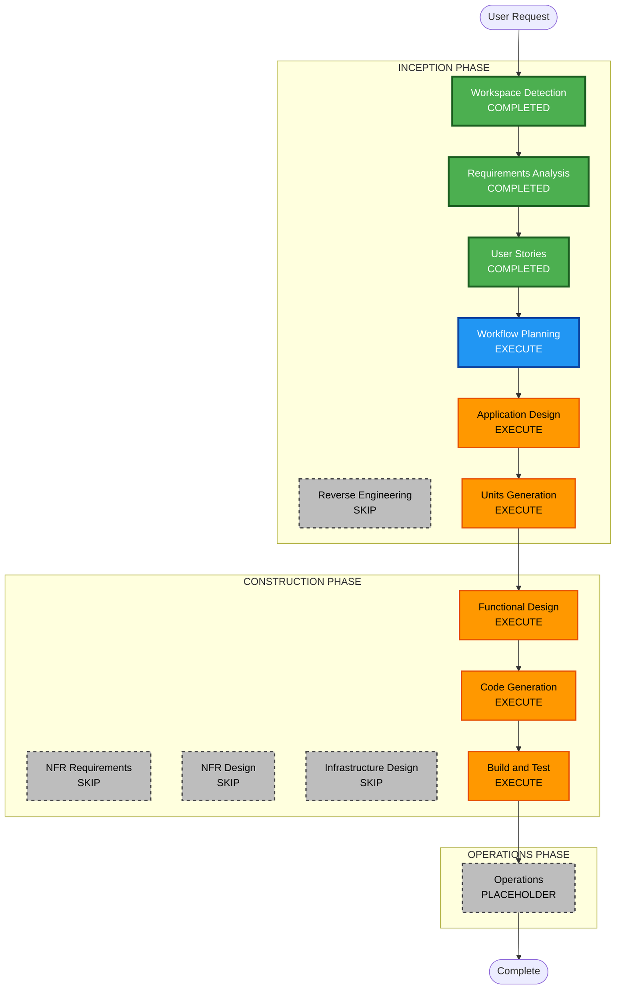

# Execution Plan — Host UI chrome inputs (`[ui]`)

**Increment**: Host UI chrome inputs  
**Requirements**: `aidlc-docs/inception/requirements/host-ui-inputs-requirements.md`  
**Stories**: `aidlc-docs/inception/user-stories/host-ui-inputs-stories.md`  
**Status**: APPROVED (Q1=A)  
**Approved**: App Design + Units (1× U-HUI-01); skip NFR/Infra; FD → CG → Build/Test  

---

## Detailed Analysis Summary

### Transformation Scope (Brownfield)
- **Transformation Type**: Application enhancement — instance `[ui]` overlay on existing chrome config
- **Primary Changes**: Shell `ui` inputs; per-instance effective features merge; reactive binding; embed/README docs
- **Related Components**: `shell-layout`, `agent-skills-shell`, `UiConfigService` / `merge-ui-features`, chrome consumers (already gated in U-UI-02)

### Change Impact Assessment
- **User-facing changes**: Yes — host can toggle chrome per shell instance
- **Structural changes**: Minor — overlay layer on existing config (no new deployable)
- **Data model changes**: No workflow document change; reuse `UiFeaturesPartial`
- **API changes**: Embed contract adds `[ui]` input (in-process)
- **NFR impact**: Partial PBT on instance merge; security new-code docs

### Component Relationships
- **Primary**: Shells + effective-features helper / service overlay
- **Dependent**: Existing U-UI-02 `@if` gates must read effective map
- **Supporting**: `docs/workflow-builder-ui-embed.md`, README

### Risk Assessment
- **Risk Level**: Low–Medium (isolated overlay; must not break omit = current behavior)
- **Rollback Complexity**: Easy (omit `[ui]`)
- **Testing Complexity**: Moderate (precedence + reactive + isolation)

---

## Workflow Visualization

Text alternative: After Workflow Planning, run Application Design and Units Generation, then Construction FD → Code Gen → Build and Test. Skip NFR Requirements/Design and Infrastructure Design. Operations remains a placeholder.

---

## Stage Recommendations

| Stage | Recommendation | Rationale |
|---|---|---|
| Application Design | **EXECUTE** | New input contract + effective-features isolation pattern |
| Units Generation | **EXECUTE** — **1 unit** (U-HUI-01): overlay + shells + docs + tests | Small cohesive slice; FR-HUI-01..07 fit one unit |
| Functional Design | **EXECUTE** | Merge/reactivity/isolation rules |
| NFR Requirements / Design | **SKIP** | Extensions already scoped; no new stack |
| Infrastructure Design | **SKIP** | Client-only |
| Code Generation | **EXECUTE** | |
| Build and Test | **EXECUTE** | |
| Operations | **PLACEHOLDER** | |

---

## Question 1 — Approve or override plan?

A) **Approve as recommended** — App Design + Units (1 unit U-HUI-01); skip NFR/Infra; then FD → CG → Build/Test

B) Split into 2 units (core overlay vs shell wiring/docs)

C) Skip Application Design; go Units → Construction

X) Other (describe after [Answer]:)

[Answer]: A

---

When done, reply **answered**.
