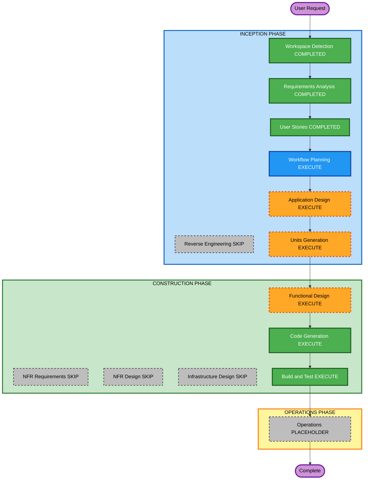

# Execution Plan — Host logic extras + agent metadata

**Increment**: Host logic extras + agent metadata  
**Requirements**: `aidlc-docs/inception/requirements/logic-icons-metadata-requirements.md`  
**Stories**: `aidlc-docs/inception/user-stories/logic-icons-metadata-stories.md` (US-LIM-01..04)  
**Status**: APPROVED (Q1=A)  
**Approved**: App Design + Units (1× U-LIM-01); skip NFR/Infra; FD → CG → Build/Test  

Content validation: Mermaid node IDs alphanumeric; no quotes in labels; text alternative included.

---

## Detailed Analysis Summary

### Transformation Scope (Brownfield)
- **Transformation Type**: Application enhancement — host catalog cards (extra logic shapes, icons, metadata)
- **Primary Changes**: `PaletteItem` / `DefaultAgentCard` fields; sanitizers; featured-strip replace; library icon render; node factory drop copy; embed docs
- **Related Components**: `palette-host.helpers`, `merge-ui-features` (JSON defaultAgents), `left-sidebar`, `node.factory`, `enso-task-catalog`, try host, `docs/workflow-builder-ui-embed.md`

### Change Impact Assessment
- **User-facing changes**: Yes — featured strip contents and library icons
- **Structural changes**: No new deployable; extend existing palette/host contracts
- **Data model changes**: Yes — optional `iconUrl`, `iconPath`, `metadata` on cards; `node.data.metadata` on drop
- **API changes**: Embed `[palettes]` / `[defaultAgents]` / JSON defaultAgents grow optional fields; featured-strip rule when `[palettes]` present **supersedes** US-HPI-01 (built-ins no longer stay)
- **NFR impact**: Icon URL allowlist (SECURITY-05/11/15); partial PBT on sanitizers

### Component Relationships
- **Primary**: Domain sanitizers + `PaletteItem` / `DefaultAgentCard`
- **Dependent**: Left sidebar featured strip and card wells; `createWorkflowNodeFromPaletteItem`
- **Supporting**: Embed docs, try harness (gitignored)

### Risk Assessment
- **Risk Level**: Low–Medium (hosts that relied on static featured three while passing `[palettes]` will see those three disappear unless they include them)
- **Rollback Complexity**: Easy (omit `[palettes]` restores static three)
- **Testing Complexity**: Moderate (replace rule + URL allowlist + metadata drop)

### Module Update Strategy
- **Update Approach**: Sequential single package (Angular SPA)
- **Critical Path**: Types/sanitizers → strip/icons UI → drop copy → docs
- **Testing Checkpoints**: Unit + partial PBT, then `npm test` / `npm run build`

---

## Workflow Visualization

### Mermaid Diagram



### Text Alternative

```
INCEPTION: Workspace Detection COMPLETED -> Reverse Engineering SKIP ->
Requirements COMPLETED -> User Stories COMPLETED -> Workflow Planning EXECUTE ->
Application Design EXECUTE -> Units Generation EXECUTE

CONSTRUCTION: Functional Design EXECUTE -> NFR Requirements SKIP ->
NFR Design SKIP -> Infrastructure Design SKIP ->
Code Generation EXECUTE -> Build and Test EXECUTE

OPERATIONS: placeholder then Complete
```

---

## Phases to Execute

### INCEPTION PHASE
- [x] Workspace Detection (COMPLETED)
- [x] Reverse Engineering (SKIPPED)
- [x] Requirements Analysis (COMPLETED)
- [x] User Stories (COMPLETED)
- [x] Execution Plan (IN PROGRESS)
- [ ] Application Design — **EXECUTE**
  - **Rationale**: New card fields, icon URL helper, featured-strip replace contract, drop mapping
- [ ] Units Generation — **EXECUTE** — **1 unit** (U-LIM-01): sanitizers + strip/icons + drop + docs (US-LIM-01..04)

### CONSTRUCTION PHASE
- [ ] Functional Design — **EXECUTE**
  - **Rationale**: Icon precedence, URL allowlist, metadata copy, strip replace rules
- [ ] NFR Requirements — **SKIP**
  - **Rationale**: Security/PBT already scoped in RA; no new stack or SLA
- [ ] NFR Design — **SKIP**
  - **Rationale**: Follows skipped NFR Requirements
- [ ] Infrastructure Design — **SKIP**
  - **Rationale**: Client-only; no cloud resources
- [ ] Code Generation — **EXECUTE** (ALWAYS)
- [ ] Build and Test — **EXECUTE** (ALWAYS)

### OPERATIONS PHASE
- [ ] Operations — PLACEHOLDER

---

## Extension compliance (this stage)

| Extension | Status | Notes |
|---|---|---|
| SECURITY-05/11/15 | Planned in FD/CG | URL allowlist + fail-safe glyph |
| Other SECURITY | N/A | No new stores/auth/infra |
| Resiliency | N/A | SPA increment |
| PBT Partial | Planned in FD/CG | Sanitizer invariants |

---

## Estimated Timeline
- **Total stages remaining (recommended)**: Application Design, Units Generation, Functional Design, Code Generation, Build and Test, Operations placeholder
- **Estimated duration**: One construction unit after design

## Success Criteria
- **Primary Goal**: Host extra logic cards with icons; metadata on drop; featured strip replace when `[palettes]` present
- **Key Deliverables**: Sanitizers, library UI, node.data copy, embed docs, tests
- **Quality Gates**: Unit + partial PBT; `npm test`; `npm run build`

---

## Question 1 — Approve or override plan?

A) **Recommended** — Application Design + Units (1 unit U-LIM-01); skip NFR/Infra; then FD → CG → Build/Test

B) Split into 2 units (sanitizers/types vs sidebar/docs)

C) Skip Application Design; go Units → Construction

X) Other (please describe after [Answer]: tag below)

[Answer]: A
