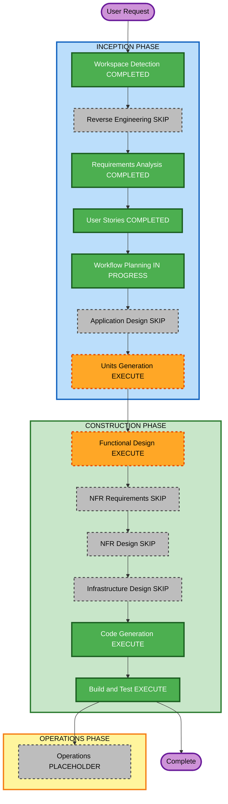

# Execution Plan — Logic Node Properties Increment

**Date**: 2026-08-13  
**Requirements**: `aidlc-docs/inception/requirements/logic-nodes-requirements.md`  
**Stories**: `aidlc-docs/inception/user-stories/logic-nodes-stories.md`  
**Does not replace**: original `execution-plan.md` (U1–U8)

---

## Detailed Analysis Summary

### Transformation Scope (Brownfield)

- **Transformation Type**: Single-app enhancement (not architectural)
- **Primary Changes**: Type-specific Properties for Condition / Router / Repeater; Condition max-2 true/false edges; Router-edge Name + Condition
- **Related Components**: Properties schema, right sidebar, `WorkflowEdge` model, connection helpers, facade/store, unit tests

### Change Impact Assessment

- **User-facing changes**: Yes — Properties fields and connect behavior
- **Structural changes**: No — same SPA, same facade
- **Data model changes**: Yes — `node.data.condition`, Repeater mock fields, `WorkflowEdge.condition`
- **API changes**: No backend
- **NFR impact**: Limited — PBT Partial on pure helpers; resiliency N/A for infra; security not enforced

### Component Relationships

- **Primary Component**: `src/app/features/shell/right-sidebar.component.ts` + `src/app/core/domain/properties.schema.ts`
- **Shared Components**: `workflow.models.ts`, `connection.math.ts` (or new pure helper next to it), `workflow.facade.ts`, serialize
- **Dependent Components**: canvas connect gesture, seed mock workflow
- **Supporting Components**: `*.spec.ts`, PBT helpers
- **Infrastructure Components**: None
- **Change Type**: Minor (compatible)
- **Change Priority**: Important for this increment

### Risk Assessment

- **Risk Level**: Low
- **Rollback Complexity**: Easy (git revert of increment)
- **Testing Complexity**: Moderate (UI forms + graph connect rules + serialize)

### Module Update Strategy

- **Update Approach**: Sequential inside one Angular package
- **Critical Path**: models/schema -> connection rules -> Properties UI -> tests
- **Coordination Points**: `assertRegistryV1Invariant` must be scoped so logic types can have extra descriptors
- **Testing Checkpoints**: unit tests after Code Generation; `npm test` / `npm run build` at Build and Test

---

## Workflow Visualization

### Mermaid



### Text alternative

```
INCEPTION
- Workspace Detection: COMPLETED
- Reverse Engineering: SKIP (U1-U8 artifacts)
- Requirements Analysis: COMPLETED
- User Stories: COMPLETED
- Workflow Planning: IN PROGRESS
- Application Design: SKIP
- Units Generation: EXECUTE (next)

CONSTRUCTION
- Functional Design: EXECUTE
- NFR Requirements: SKIP
- NFR Design: SKIP
- Infrastructure Design: SKIP
- Code Generation: EXECUTE (always)
- Build and Test: EXECUTE (always)

OPERATIONS
- Operations: PLACEHOLDER
```

---

## Phases to Execute

### INCEPTION PHASE

- [x] Workspace Detection (COMPLETED)
- [x] Reverse Engineering (SKIPPED — construction artifacts current)
- [x] Requirements Analysis (COMPLETED)
- [x] User Stories (COMPLETED)
- [x] Execution Plan (IN PROGRESS)
- [ ] Application Design - SKIP
  - **Rationale**: Work stays inside existing Properties, models, facade, and canvas connect. No new service layer. Method-level rules go to Functional Design.
- [ ] Units Generation - EXECUTE
  - **Rationale**: New `WorkflowEdge.condition` plus per-type schema. Need one construction unit (`u9-logic-nodes`) mapping US-LN-01..07.

### CONSTRUCTION PHASE

- [ ] Functional Design - EXECUTE
  - **Rationale**: Connection rules, uniqueness, dependent Version dropdown, and schema descriptors need explicit business rules.
- [ ] NFR Requirements - SKIP
  - **Rationale**: Stack already chosen. Security extension off. Resiliency infra N/A. PBT Partial carried as a construction constraint, not a new NFR stage.
- [ ] NFR Design - SKIP
  - **Rationale**: NFR Requirements skipped.
- [ ] Infrastructure Design - SKIP
  - **Rationale**: No cloud/infra changes.
- [ ] Code Generation - EXECUTE (ALWAYS)
  - **Rationale**: Implementation planning then code, tests, artifacts.
- [ ] Build and Test - EXECUTE (ALWAYS)
  - **Rationale**: `npm test` and `npm run build`.

### OPERATIONS PHASE

- [ ] Operations - PLACEHOLDER
  - **Rationale**: Same as original product.

---

## Package Change Sequence

1. Domain models + schema registry + pure connection/uniqueness helpers
2. Facade/store serialize
3. Right sidebar / edge panel UI
4. Canvas connect gesture wiring
5. Tests (including PBT on pure helpers)

Single npm package: `workflow-builder`.

## Estimated Timeline

- **Total remaining stages**: 4 (Units Generation, Functional Design, Code Generation, Build and Test)
- **Estimated duration**: One construction pass after unit + functional design approvals

## Success Criteria

- **Primary Goal**: Enso-like Condition / Router / Repeater properties and edge rules in the builder
- **Key Deliverables**: Schema + UI + connect rules + tests
- **Quality Gates**: Stories US-LN-01..07 pass AC; `npm test`; `npm run build`
- **Integration Testing**: Seed workflow with Condition, Router, Repeater still loads
- **Operational Readiness**: N/A (in-memory SPA)
