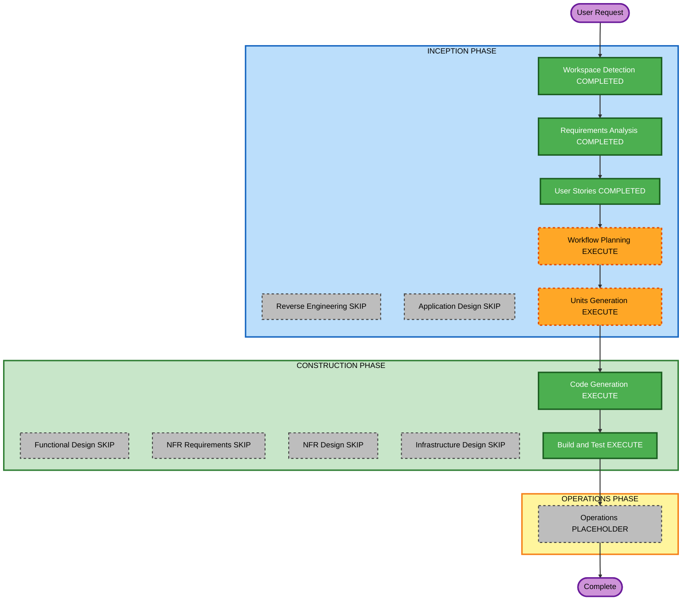

# Execution Plan — npm package publish

**Increment**: npm package publish (`enso-workflow-builder`)  
**Requirements**: `aidlc-docs/inception/requirements/npm-package-requirements.md`  
**Stories**: `aidlc-docs/inception/user-stories/npm-package-stories.md` (US-NP-01..04)  
**Status**: APPROVED (Q1=A)  
**Approved**: Skip App Design and Functional Design; 1 unit; skip NFR/Infra; then CG → Build/Test  

Fill **Question 1** below, then reply in chat (for example `answered`). You may override any EXECUTE/SKIP.

Content validation: Mermaid node IDs alphanumeric; no quotes in labels; text alternative included.

---

## Detailed Analysis Summary

### Transformation Scope (Brownfield)
- **Transformation Type**: Same repo; add ng-packagr library; SPA remains
- **Primary Changes**: library project, public barrel, peerDeps, styles/tokens, `npm pack`, embed docs
- **Related Components**: `angular.json`, `projects/enso-workflow-builder` (or similar), `src/app` (SPA consumer), `docs/workflow-builder-ui-embed.md`

### Change Impact Assessment
- **User-facing changes**: Yes — hosts install `enso-workflow-builder` instead of copying `src`
- **Structural changes**: New library project; no new microservice
- **Data model changes**: None
- **API changes**: Public npm barrel (shells, provider, facade)
- **NFR impact**: No secrets in tarball; PBT Partial unchanged unless new transforms

### Component Relationships
- **Primary**: Angular library (`enso-workflow-builder`)
- **Shared**: Existing `src/app` sources moved or re-exported
- **Dependent**: SPA demo; host apps
- **Supporting**: Embed docs, pack script

| Related | Change Type | Priority |
|---|---|---|
| ng-packagr project | Major | Critical |
| Public barrel + peerDeps | Major | Critical |
| Styles/tokens | Minor | Important |
| npm pack | Major | Critical |
| Docs / SPA green | Minor | Critical |

### Risk Assessment
- **Risk Level**: Medium — library extract can break SPA imports if paths drift
- **Rollback Complexity**: Easy (git revert)
- **Testing Complexity**: Moderate (library build + pack + existing `npm test`)

### Module Update Strategy
- **Update Approach**: Sequential single repo
- **Critical Path**: library project → public API → styles → pack → docs/SPA tests
- **Coordination Points**: Do not publish try/; Angular as peerDeps
- **Testing Checkpoints**: library `ng build`, `npm pack`, SPA `npm test` / `npm run build`
- **Rollback**: Revert the increment commit

---

## Workflow Visualization

### Mermaid Diagram



### Text Alternative

```
INCEPTION: Workspace Detection COMPLETED -> Reverse Engineering SKIP ->
Requirements COMPLETED -> User Stories COMPLETED -> Workflow Planning EXECUTE ->
Application Design SKIP -> Units Generation EXECUTE (1 unit)

CONSTRUCTION: Functional Design SKIP -> NFR Requirements SKIP ->
NFR Design SKIP -> Infrastructure Design SKIP ->
Code Generation EXECUTE -> Build and Test EXECUTE

OPERATIONS: placeholder then Complete
```

---

## Phases to Execute

### INCEPTION PHASE
- [x] Workspace Detection (COMPLETED)
- [x] Reverse Engineering (SKIPPED)
- [x] Requirements Analysis (COMPLETED)
- [x] User Stories (COMPLETED)
- [x] Execution Plan (APPROVED Q1=A)
- [x] Application Design — **SKIP**
  - **Rationale**: RA already locks name, peers, public API, pack-not-publish
- [x] Units Generation — **COMPLETED** — **1 unit** (U-NP-01): library + pack + docs (US-NP-01..04)

### CONSTRUCTION PHASE
- [x] Functional Design — **SKIP**
  - **Rationale**: Packaging, not new business rules
- [x] NFR Requirements — **SKIP**
  - **Rationale**: Security / Resiliency / PBT scoped in RA; no new stack
- [x] NFR Design — **SKIP**
- [x] Infrastructure Design — **SKIP**
  - **Rationale**: Client library; no cloud deploy
- [x] Code Generation — **COMPLETED**
- [x] Build and Test — **COMPLETED**

### OPERATIONS PHASE
- [x] Operations — PLACEHOLDER

---

## Package Change Sequence

1. ng-packagr library project + `enso-workflow-builder` @ 0.1.0 + peerDeps (FR-NP-01, FR-NP-02, FR-NP-05)
2. Public barrel: shells, provider, facade (FR-NP-03)
3. Styles/tokens (FR-NP-04)
4. `npm pack`; embed docs; SPA tests green; no try/secrets (FR-NP-06..09)

---

## Extension compliance (this stage)

| Extension | Status | Notes |
|---|---|---|
| Security Baseline | Planned in CG | No secrets in tarball or docs |
| Other SECURITY | N/A | No new stores/auth/infra |
| Resiliency Baseline | Directional / N/A | DR N/A; fail-safe from U-HE-01 unchanged |
| PBT Partial | Existing serialize PBT; no new transform expected |

---

## Estimated Timeline
- **Total stages remaining (recommended)**: Units Generation, Code Generation, Build and Test, Operations placeholder
- **Estimated duration**: One construction unit

## Success Criteria
- **Primary Goal**: Hosts install `enso-workflow-builder` and import the embed API
- **Key Deliverables**: Library build, tarball, docs, SPA still green
- **Quality Gates**: library build; `npm pack`; `npm test`; SPA `npm run build`
- **Integration Testing**: Public exports exist; tarball excludes try/

---

## Question 1

**Approve this execution plan?**

A) **Recommended** — Skip Application Design and Functional Design; 1 unit; skip NFR/Infra; then CG → Build/Test

B) Add Application Design + Functional Design before CG (same 1 unit)

C) Skip Units Generation; one CG plan at repo root with no unit folder

X) Other (please describe after [Answer]: tag below)

[Answer]: A
