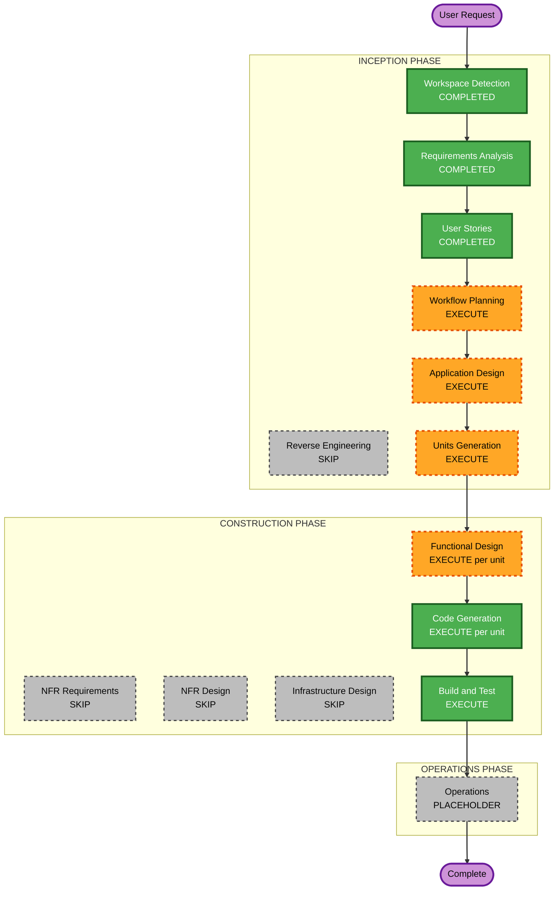

# Execution Plan — Palette / catalog host config (v1)

**Increment**: Palette / catalog host config  
**Requirements**: `aidlc-docs/inception/requirements/palette-host-config-requirements.md`  
**Stories**: `aidlc-docs/inception/user-stories/palette-host-config-stories.md`  
**Status**: APPROVED (Q1=A)  
**Approved**: App Design + Units; U-PAL-01 then U-PAL-02; skip NFR/Infra  

---

## Detailed Analysis Summary

### Transformation Scope (Brownfield)
- **Transformation Type**: Application feature (palette config + catalog adapter); not infrastructure
- **Primary Changes**: Extend `ui-config` with palette allow-lists and `defaultAgents`; catalog adapter injection; filter Enso/static rows; remove mock-agent fallback; embed docs
- **Related Components**: `core/ui-config`, `EnsoTaskCatalogService`, `left-sidebar`, `palette.catalog`, `node.factory` / facade create-from-palette, `docs/workflow-builder-ui-embed.md`

### Change Impact Assessment
- **User-facing changes**: Yes — library contents (types, default agent names)
- **Structural changes**: Yes — adapter contract + palette config tree (no deploy model change)
- **Data model changes**: Yes — palette config types (not workflow document schema)
- **API changes**: No new backend; host adapter is an in-process contract (may call extra HTTP inside the host)
- **NFR impact**: No secrets in JSON; no token logs; PBT on allow-list filter + defaultAgents merge; fail-open omitted keys; failure banner without mocks

### Component Relationships
- **Primary**: `UiConfigService` / merge + `EnsoTaskCatalogService` (default adapter)
- **Dependent**: `LeftSidebarComponent` featured strip and lists; chrome flags still master-switch libraries
- **Supporting**: Example JSON under `src/assets/examples/`; embed/try markdown under `docs/`

### Risk Assessment
- **Risk Level**: Medium (defaults must preserve today’s palette; adapter replace vs Enso)
- **Rollback Complexity**: Easy (omit config ⇒ current types + Blank Agent + Enso)
- **Testing Complexity**: Moderate (filter PBT, defaultAgents present vs omitted vs `[]`, adapter vs Enso)

### Module Update Strategy
- **Update Approach**: Sequential single SPA
- **Critical Path**: Config merge/filter before sidebar wiring
- **Coordination Points**: Type keys (`Decision` = Router); `AIAgent` gates defaultAgents
- **Testing Checkpoints**: Unit filter/merge; chrome library still respects `agentsLibrary`/`skillsLibrary`

---

## Workflow Visualization

Text alternative: Inception WD completed, RE skip, RA/US completed, WP then App Design then Units. Construction FD then Code Gen per unit, then Build and Test. NFR Requirements, NFR Design, and Infrastructure Design skip. Operations placeholder.

---

## Phases to Execute (recommendations)

### INCEPTION
- [x] Workspace Detection — COMPLETED
- [x] Reverse Engineering — SKIP (scoped increment)
- [x] Requirements Analysis — COMPLETED
- [x] User Stories — COMPLETED
- [ ] Workflow Planning — **EXECUTE** (this document)
- [x] Application Design — **EXECUTE** (palette config types, adapter interface, filter/merge, sidebar consumers)
- [x] Units Generation — **EXECUTE** (proposed two units below)

### CONSTRUCTION (per unit)
- [ ] Functional Design — **EXECUTE**
- [ ] NFR Requirements — **SKIP** (stack fixed; Security/PBT/fail-open carried in FD/CG)
- [ ] NFR Design — **SKIP**
- [ ] Infrastructure Design — **SKIP** (no cloud resources)
- [ ] Code Generation — **EXECUTE**
- [ ] Build and Test — **EXECUTE** (after all units)

### OPERATIONS
- [ ] Placeholder only

---

## Proposed units (for Units Generation)

| Unit | Scope | Stories |
|---|---|---|
| **U-PAL-01** Palette config core | Types, merge, allow-list filter, `defaultAgents` present/`[]`/omitted, PBT | US-PAL-01, US-PAL-02, US-PAL-03, US-PAL-04 |
| **U-PAL-02** Catalog wiring + docs | Adapter injection, Enso default, failure no mocks, sidebar strip/lists, embed examples | US-PAL-05, US-PAL-06, US-PAL-07 |

**Sequence**: Strict — U-PAL-01 then U-PAL-02.

---

## Extension compliance (planning)

| Extension | Plan |
|---|---|
| Security | New JSON/docs — no tokens; adapters must not log Authorization |
| Resiliency | Adapter/Enso fail → static defaults + banner; cloud DR N/A |
| PBT Partial | Allow-list filter invariant + defaultAgents merge in U-PAL-01 |

---

## Your control

You may **override** any EXECUTE/SKIP or unit split before we proceed.

---

## Question 1 — Approve this execution plan?

A) **Approve as recommended** (App Design + Units; 2 units; skip NFR/Infra)

B) **Approve but single unit** (combine U-PAL-01 + U-PAL-02)

C) **Approve but skip Application Design** (go to Units / Functional Design)

X) Other (describe after [Answer]: tag below)

[Answer]: A
