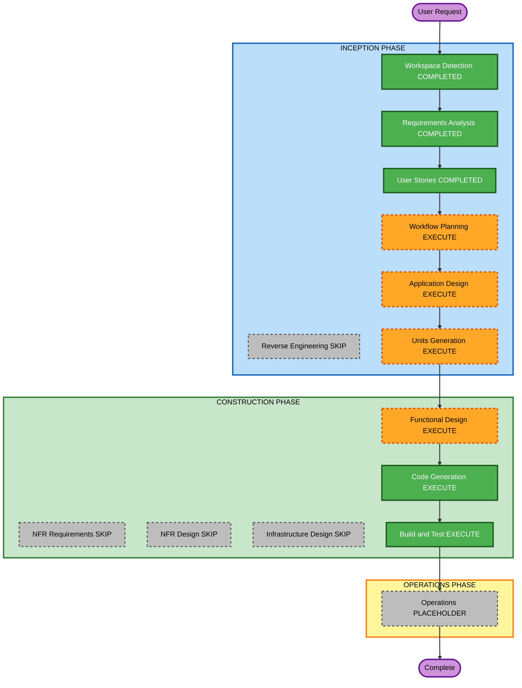

# Execution Plan — Remove APIs and dummy data

**Increment**: Remove APIs and dummy data  
**Requirements**: `aidlc-docs/inception/requirements/remove-apis-dummy-data-requirements.md`  
**Stories**: `aidlc-docs/inception/user-stories/remove-apis-dummy-data-stories.md` (US-RAD-01..04)  
**Status**: APPROVED (Q1=A)  
**Approved**: App Design + Units (1× U-RAD-01); skip NFR/Infra; FD → CG → Build/Test  

Fill **Question 1** below, then reply in chat (for example `answered`). You may override any EXECUTE/SKIP.

Content validation: Mermaid node IDs alphanumeric; no quotes in labels; text alternative included.

---

## Detailed Analysis Summary

### Transformation Scope (Brownfield)
- **Transformation Type**: Application cleanup — remove Enso catalog HTTP and dummy catalogs; change omit-palettes default
- **Primary Changes**: Stop `task/list` / `pipeline/list`; strip `/enso-api` proxy and env URLs/credentials; omit `[palettes]` without adapter = `emptyRemote`; nested Skills Library from agent-shell `[palettes]`; delete `MOCK_SKILLS` and `REPEATER_MOCK_WORKFLOWS`; embed/README
- **Related Components**: `EnsoTaskCatalogService`, `environment.ts` / `environment.prod.ts`, `proxy.conf.json`, `angular.json` proxyConfig, `nested-skills-library`, `right-sidebar` / `properties.schema`, catalog compose, `docs/workflow-builder-ui-embed.md`, `README.md`

### Change Impact Assessment
- **User-facing changes**: Yes — default SPA library is empty-remote; nested list matches host palettes; Repeater pickers empty
- **Structural changes**: No new deployable; remove HTTP catalog path; keep optional catalog adapter
- **Data model changes**: No new workflow schema; node.data unchanged
- **API changes**: Host embed contract: omit `[palettes]` is empty (supersedes US-HPI-01 / US-LIM-01 omit AC); no Enso HTTP from this SPA
- **NFR impact**: Remove stored credentials (SECURITY); empty-remote is no-data path (resiliency); PBT Partial on omit-without-adapter compose

### Component Relationships
- **Primary**: `EnsoTaskCatalogService` (catalog source / compose)
- **Dependent**: Left sidebar empty-remote; `wb-nested-skills-library`; Repeater Properties pickers
- **Shared**: Catalog adapter token (`provideWorkflowBuilderUi({ catalog })`) kept
- **Supporting**: Embed docs, README, unit specs

| Related | Change Type | Priority |
|---|---|---|
| Enso HTTP + env + proxy | Major (remove) | Critical |
| Compose omit-without-adapter | Major (empty-remote) | Critical |
| Nested skills palettes input | Minor (wire existing overlay) | Critical |
| Repeater mock catalog | Minor (delete dummy options) | Important |
| Docs / README | Configuration/docs | Important |

### Risk Assessment
- **Risk Level**: Medium — default `npm start` library becomes empty; hosts that relied on Enso or static featured-on-omit must bind `[palettes]` or an adapter
- **Rollback Complexity**: Easy (git revert; no schema migration)
- **Testing Complexity**: Moderate (HTTP gone; omit vs adapter; nested palettes; specs that assumed Enso/mocks)

### Module Update Strategy
- **Update Approach**: Sequential single package (Angular SPA)
- **Critical Path**: Env/proxy/HTTP out → compose omit empty-remote → nested palettes → Repeater mocks → docs/tests
- **Coordination Points**: U-PAL-02 adapter-when-omit stays; U-LIM overlay when palettes present
- **Testing Checkpoints**: Unit + partial PBT, then `npm test` / `npm run build`
- **Rollback**: Revert the increment commit

---

## Workflow Visualization

### Mermaid Diagram



### Text Alternative

```
INCEPTION: Workspace Detection COMPLETED -> Reverse Engineering SKIP ->
Requirements COMPLETED -> User Stories COMPLETED -> Workflow Planning EXECUTE ->
Application Design EXECUTE -> Units Generation EXECUTE

CONSTRUCTION: Functional Design EXECUTE -> NFR Requirements SKIP ->
NFR Design SKIP -> Infrastructure Design SKIP ->
Code Generation EXECUTE -> Build and Test EXECUTE

OPERATIONS: placeholder then Complete
```

---

## Phases to Execute

### INCEPTION PHASE
- [x] Workspace Detection (COMPLETED)
- [x] Reverse Engineering (SKIPPED)
- [x] Requirements Analysis (COMPLETED)
- [x] User Stories (COMPLETED)
- [x] Execution Plan (APPROVED Q1=A)
- [ ] Application Design — **EXECUTE**
  - **Rationale**: Catalog source order (no Enso HTTP; omit = empty-remote; adapter-when-omit kept); nested library palettes input; Repeater picker empty contract
- [ ] Units Generation — **EXECUTE** — **1 unit** (U-RAD-01): HTTP/env/proxy + compose + nested palettes + Repeater mocks + docs (US-RAD-01..04)

### CONSTRUCTION PHASE
- [x] Functional Design — **EXECUTE**
  - **Rationale**: Compose omit-without-adapter invariant; nested overlay data flow; empty Repeater options
- [x] NFR Requirements — **SKIP**
  - **Rationale**: Security / Resiliency / PBT already scoped in RA; no new stack or SLA; enforce in FD/CG
- [x] NFR Design — **SKIP**
  - **Rationale**: Follows skipped NFR Requirements
- [x] Infrastructure Design — **SKIP**
  - **Rationale**: Client-only; proxy removal is local Angular serve config, not cloud resources
- [x] Code Generation — **EXECUTE** (ALWAYS)
- [x] Build and Test — **EXECUTE** (ALWAYS) — approved

### OPERATIONS PHASE
- [x] Operations — PLACEHOLDER

---

## Package Change Sequence

1. Environment + proxy + `EnsoTaskCatalogService` HTTP removal (FR-RAD-01)
2. Compose omit-without-adapter = empty-remote (FR-RAD-02)
3. Nested Skills Library palettes overlay; delete MOCK_SKILLS usage (FR-RAD-03, FR-RAD-04)
4. Repeater mock catalog removal (FR-RAD-05)
5. Docs + specs (FR-RAD-06, NFR-RAD-01..03)

---

## Extension compliance (this stage)

| Extension | Status | Notes |
|---|---|---|
| Security Baseline | Planned in FD/CG | Strip catalog credentials from env; no secrets in docs |
| Other SECURITY | N/A | No new stores/auth/infra |
| Resiliency Baseline | Planned in FD/CG | Empty-remote is no-data path; DR N/A |
| PBT Partial | Planned in FD/CG | Omit-without-adapter never emits Enso/static featured rows |

---

## Estimated Timeline
- **Total stages remaining (recommended)**: Application Design, Units Generation, Functional Design, Code Generation, Build and Test, Operations placeholder
- **Estimated duration**: One construction unit after design

## Success Criteria
- **Primary Goal**: No Enso catalog HTTP; omit palettes is empty-remote; no dummy nested skills or Repeater workflows
- **Key Deliverables**: HTTP/env/proxy removed; compose + nested palettes; empty Repeater pickers; docs; tests
- **Quality Gates**: Unit + partial PBT; `npm test`; `npm run build`
- **Integration Testing**: Default SPA empty library; palettes overlay still works; adapter-when-omit still works

---

## Question 1

**Approve this execution plan?**

A) **Recommended** — Application Design + Units (1 unit U-RAD-01); skip NFR/Infra; then FD → CG → Build/Test

B) Skip Application Design; go Units → Construction

C) Split into 2 units (catalog HTTP/empty omit vs nested+repeater+docs)

X) Other (please describe after [Answer]: tag below)

[Answer]: A
