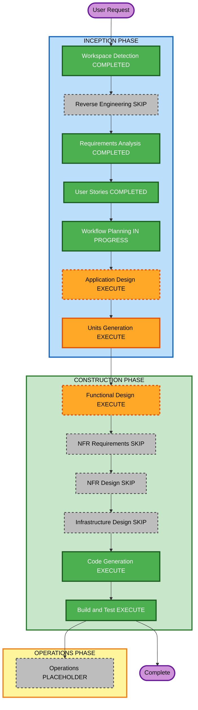

# Execution Plan — Solution Workflow Increment

**Date**: 2026-08-15  
**Requirements**: `aidlc-docs/inception/requirements/solution-workflow-requirements.md`  
**Stories**: `aidlc-docs/inception/user-stories/solution-workflow-stories.md` (US-SW-01..05)  
**Personas**: `aidlc-docs/inception/user-stories/personas.md`  
**Does not replace**: original `execution-plan.md` (U1–U8) or `logic-nodes-execution-plan.md`

### Units override (2026-08-15)

Units Generation locked **two strict sequential units** instead of a single P0+P1 unit:

- **U-SW-01a** (P0) — palette + agent tabs  
- **U-SW-01b** (P1) — nested route + skills list + Back — starts only after 01a Build/Test approval  

See `solution-workflow-unit-of-work.md`.

---

## Detailed Analysis Summary

### Transformation Scope (Brownfield)

- **Transformation Type**: Single-app enhancement (not architectural / no infra redeploy)
- **Primary Changes**: Solution palette (Condition / Router / Repeater + Blank Agent); double-click → nested skills canvas; mock skills catalog; Back + in-session nested persistence; Properties / view-mode parity
- **Related Components**: palette catalog, left sidebar, canvas node interaction, shell navigation / facade / store, workflow models (nested graph on agent), Properties sidebar, unit + PBT tests

### Change Impact Assessment

- **User-facing changes**: Yes — new solution authoring journey (palette + nested agent skills)
- **Structural changes**: Limited — same SPA shell; add nested editing context / route-or-state for agent-inside-agent
- **Data model changes**: Yes — nested skills graph stored on Blank Agent node data (or document subtree); mock skill node type/catalog
- **API changes**: No backend; no live skills API
- **NFR impact**: Local-only latency (NFR-SW-01); PBT Partial on pure helpers; resiliency DR N/A; existing tests stay green

### Component Relationships

- **Primary Component**: Shell (left sidebar palette + canvas node dblclick + Back chrome) and facade/store for nested context
- **Shared Components**: `palette.catalog.ts`, `workflow.models.ts`, serialize/document helpers, `right-sidebar` Properties patterns, connection/DnD reuse where applicable
- **Dependent Components**: empty Untitled boot (R58), edit/view mode gating
- **Supporting Components**: `*.spec.ts`, fast-check PBT for catalog / nested merge helpers
- **Infrastructure Components**: None
- **Change Type**: Minor–Moderate (compatible SPA enhancement)
- **Change Priority**: Critical for this increment

### Risk Assessment

- **Risk Level**: Medium
- **Rollback Complexity**: Easy–Moderate (git revert of increment; nested data shape must not break prior serialize consumers)
- **Testing Complexity**: Moderate (palette, navigation, persistence round-trip in-session, view-mode locks)

### Module Update Strategy

- **Update Approach**: Sequential inside one Angular package (`src/app`)
- **Critical Path**: models/nested storage → palette Blank Agent restore → nested context + mock skills → Back persistence → Properties/view mode → tests
- **Coordination Points**: Keep R58 empty boot; do not reintroduce Sample Automation as default; distinguish Router node from removed canvas Route chrome
- **Testing Checkpoints**: unit/PBT after Code Generation; `npm test` / `npm run build` at Build and Test

---

## Workflow Visualization

### Mermaid



### Text alternative

```text
INCEPTION
  Workspace Detection     COMPLETED
  Reverse Engineering     SKIP
  Requirements Analysis   COMPLETED
  User Stories            COMPLETED
  Workflow Planning       IN PROGRESS (this document)
  Application Design      EXECUTE
  Units Generation        EXECUTE

CONSTRUCTION (per unit U-SW-01 = P0+P1)
  Functional Design       EXECUTE
  NFR Requirements        SKIP
  NFR Design              SKIP
  Infrastructure Design   SKIP
  Code Generation         EXECUTE
  Build and Test          EXECUTE

OPERATIONS
  Operations              PLACEHOLDER
```

---

## Phases to Execute

### INCEPTION PHASE

- [x] Workspace Detection (COMPLETED)
- [x] Reverse Engineering (SKIPPED — prior artifacts sufficient)
- [x] Requirements Analysis (COMPLETED)
- [x] User Stories (COMPLETED — US-SW-01..05)
- [x] Workflow Planning (IN PROGRESS — this plan)
- [ ] Application Design — **EXECUTE**
  - **Rationale**: Nested skills canvas is a new editing context with shell reuse, navigation (dblclick / Back), and nested graph ownership on Blank Agent; needs explicit component/service boundaries before units
- [ ] Units Generation — **EXECUTE**
  - **Rationale**: First construction unit is **P0 + P1** together (verification Q3=B); formalize as one unit with model + UX + tests scope

### CONSTRUCTION PHASE (unit U-SW-01)

- [ ] Functional Design — **EXECUTE**
  - **Rationale**: Nested document shape, skill node typing, persistence merge rules, and view-mode behavior need design artifacts
- [ ] NFR Requirements — **SKIP**
  - **Rationale**: NFR-SW-* already captured in requirements; stack unchanged; no new SLA/infra targets (DR N/A)
- [ ] NFR Design — **SKIP**
  - **Rationale**: No NFR Requirements stage; latency/PBT handled in Functional Design + Code Generation
- [ ] Infrastructure Design — **SKIP**
  - **Rationale**: No cloud, deploy, or IaC changes
- [ ] Code Generation — **EXECUTE** (ALWAYS)
  - **Rationale**: Implement palette, nested canvas, mock skills, Back persistence, tests
- [ ] Build and Test — **EXECUTE** (ALWAYS)
  - **Rationale**: Verify suites green + new coverage

### OPERATIONS PHASE

- [ ] Operations — PLACEHOLDER

---

## Package Change Sequence (Brownfield)

1. `src/app/core/domain` — nested graph types, mock skills catalog, pure helpers (+ PBT)
2. Facade / store — nested editing context enter/exit + persistence
3. Shell UI — palette Blank Agent, dblclick, Back, nested library
4. Properties / view mode — reuse + nested locks
5. Specs — palette presence, navigation hook, persistence, view mode

---

## Estimated Timeline

- **Total stages remaining (recommended)**: Application Design, Units Generation, Functional Design, Code Generation, Build and Test (5)
- **Skipped**: Reverse Engineering (done), NFR Requirements, NFR Design, Infrastructure Design, Operations
- **Estimated duration**: One focused construction pass for U-SW-01 (P0+P1)

---

## Success Criteria

- **Primary Goal**: Solution workflow with Blank Agent → nested mock-skills canvas → Back with in-session persistence
- **Key Deliverables**: Featured strip + Blank Agent; dblclick nested canvas; mock skills addable; Back restores solution canvas; tests green
- **Quality Gates**: US-SW-01..05 AC; FR-SW-01..05; NFR-SW-03 tests; PBT Partial on new pure helpers
- **Integration Testing**: Nested enter/exit within SPA; edit vs view mode on nested canvas
- **Operational Readiness**: N/A for new deployables (client-only increment)

---

## Extension Compliance (Workflow Planning)

| Extension | Rule focus | Status | Notes |
|---|---|---|---|
| Resiliency Baseline | DR / deploy / RTO | N/A | Client SPA increment; DR N/A per RA; no new production deployable |
| Resiliency Baseline | Change/rollback awareness | Compliant | Rollback = git revert of increment documented above |
| PBT (Partial) | PBT-02/03/07/08/09 | Compliant (plan) | Plan requires fast-check on nested merge / catalog helpers in Construction |
| PBT (Partial) | Other PBT rules | Advisory | Full suite not required in Partial mode |
| Security Baseline | — | N/A | Extension disabled |
