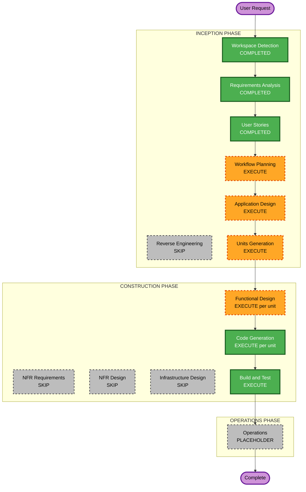

# Execution Plan — UI Configurability (v1)

**Increment**: UI Configurability  
**Requirements**: `aidlc-docs/inception/requirements/ui-configurability-requirements.md`  
**Stories**: `aidlc-docs/inception/user-stories/ui-configurability-stories.md`  
**Status**: APPROVED (Q1=A)  
**Approved**: App Design + Units; U-UI-01 then U-UI-02; skip NFR/Infra  

---

## Detailed Analysis Summary

### Transformation Scope (Brownfield)
- **Transformation Type**: Application feature (config + chrome wiring); not infrastructure
- **Primary Changes**: UI feature map, InjectionToken / `provideWorkflowBuilderUi`, JSON load, shell/canvas `@if` gating, embed docs
- **Related Components**: `top-bar`, `left-sidebar`, `right-sidebar`, `shell-layout`, `canvas-viewport` / overlays, `app.config`, `environment` / `public` assets

### Change Impact Assessment
- **User-facing changes**: Yes — chrome visibility per host config
- **Structural changes**: Yes — new config domain + provider (no deploy model change)
- **Data model changes**: Yes — typed UI feature map (not workflow document schema)
- **API changes**: No backend API; embed provider is an in-process contract
- **NFR impact**: Security (no secrets in demo JSON); PBT on merge; soft-fail JSON load

### Component Relationships
- **Primary**: New `core/ui-config` (or equivalent) + `WorkflowFacade` / shell consumers
- **Dependent**: All chrome components reading `isEnabled(path)`
- **Supporting**: Demo JSON under `public/` or `assets/`; markdown embed guide under `aidlc-docs` or `docs/`

### Risk Assessment
- **Risk Level**: Medium (many touchpoints; defaults must preserve current UX)
- **Rollback Complexity**: Easy (flag defaults = show all)
- **Testing Complexity**: Moderate (merge PBT + visibility unit/component checks)

---

## Workflow Visualization

Text alternative: Inception WD→RA→US→WP→AD→UG complete/execute as above; Construction FD→CG per unit then BT; NFR/Infra skip; Operations placeholder.

---

## Phases to Execute (recommendations)

### INCEPTION
- [x] Workspace Detection — COMPLETED
- [x] Reverse Engineering — SKIP (focused increment)
- [x] Requirements Analysis — COMPLETED
- [x] User Stories — COMPLETED
- [ ] Workflow Planning — **EXECUTE** (this document)
- [ ] Application Design — **EXECUTE** (provider, token, merge service, consumers)
- [ ] Units Generation — **EXECUTE** (proposed two units below)

### CONSTRUCTION (per unit)
- [ ] Functional Design — **EXECUTE**
- [ ] NFR Requirements — **SKIP** (stack fixed; Security/PBT constraints carried in FD/CG)
- [ ] NFR Design — **SKIP**
- [ ] Infrastructure Design — **SKIP** (no cloud resources)
- [ ] Code Generation — **EXECUTE**
- [ ] Build and Test — **EXECUTE** (after all units)

### OPERATIONS
- [ ] Placeholder only

---

## Proposed units (for Units Generation)

| Unit | Scope | Stories |
|---|---|---|
| **U-UI-01** Config core | Feature map types, defaults, deep-merge, JSON load, `provideWorkflowBuilderUi`, PBT merge | US-UI-01, US-UI-07 |
| **U-UI-02** Chrome wiring + docs | Gate top bar, libraries, properties, canvas overlays, shortcuts; demo JSON; embed API doc | US-UI-02…06, US-UI-08 |

**Sequence**: Strict — U-UI-01 then U-UI-02.

---

## Extension compliance (planning)

| Extension | Plan |
|---|---|
| Security | New config/demo code only — no tokens in committed JSON |
| Resiliency | Soft-fail JSON load; other cloud DR N/A |
| PBT Partial | Merge/default helpers in U-UI-01 |

---

## Your control

You may **override** any EXECUTE/SKIP or unit split before we proceed.

---

## Question 1 — Approve this execution plan?

A) **Approve as recommended** (App Design + Units; 2 units; skip NFR/Infra)

B) **Approve but single unit** (combine U-UI-01 + U-UI-02)

C) **Approve but skip Application Design** (go straight to Units / FD)

X) Other (describe after [Answer]:)

[Answer]: A
